# Лаба 1 — Свой Docker

Задание лабораторной работы: https://github.com/KeladKaal/containerization-and-orchestration/blob/main-rus/lecture-1-docker/lab.md

## Часть 0 - Свой сервис

Сперва был написал простенький сервис на go, не без помощи агентов. Код представлен в [файле](./api-service/main.go)

Эндпоинты: 
* GET /health — возвращает ok;
* GET /eat?mb=N — выделяет N мегабайт памяти и держит их;
* GET /burn — нагружает одно ядро CPU в бесконечном цикле.

## Часть 1 - Прямой запуск

Был собран бинарный файл. Через браузер дернули health-chek


После получения ok, смотрим процесс через ps и получаем его PID
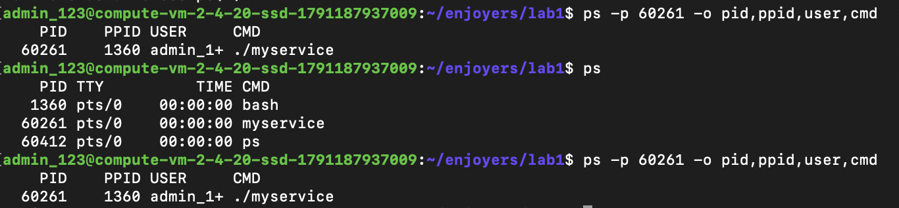

## Часть 2 — namespaces

На этом легкая часть кончилась, по неопытности было непросто... и не быстро... 💀 

Набравшись из интернтов и от агентов знаний, мы сформировали коману с unshare. У нас получилось
```bash
unshare -U -r -p -f -m -n -u -i /bin/bash
```
Но сразу же нам дали понять, что мы в корне не правы
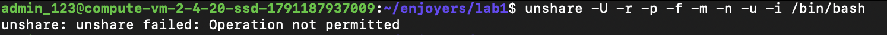

Система по умолчанию ограничивает создание user namespaces для непривилегированных пользователей. Пришлось менять параметры
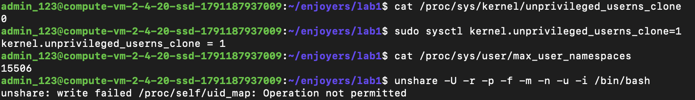
Но, как видно из картинки выше, нам это не сильно помогло, и мы уперлись в другую проблему.

Как мы выяснили В Ubuntu 24.04 есть дополнительные sysctl-флаги AppArmor, которые блокируют user namespaces на уровне ядра, независимо от профилей.

Но нам удалось обойти это, и мы наконец-то смогли попасть в изолированную среду
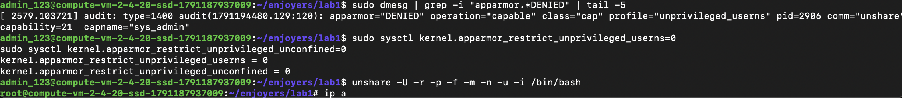

После попадания в изолированную среду мы проверили сетевую доступность, переименовали hostname, перемонтировали /proc и увидели процессы в оболочке.
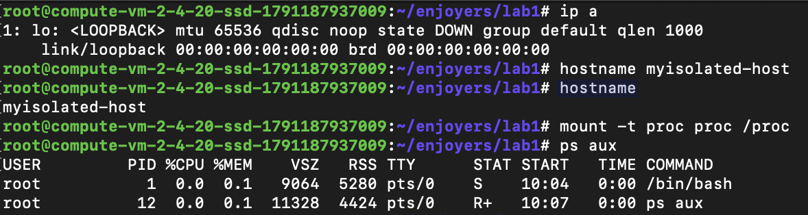

Радостные мы запустили наш сервис в изолированной среде и отправили запрос... но ничего не вышло из-за сетевых играничений, но мы исправили и это.
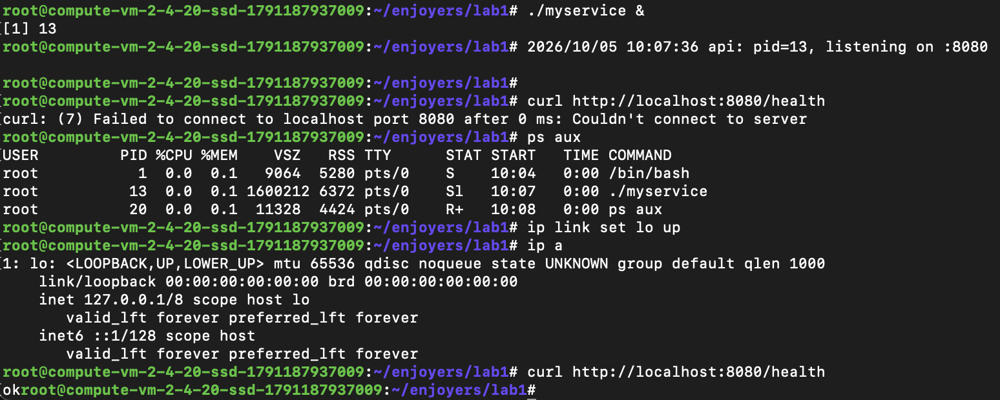

Также для проверки того, что root в изолированной среде - это другой root, мы вышли из нее и посмотрели PID процесса, который в изолированной среде был 13
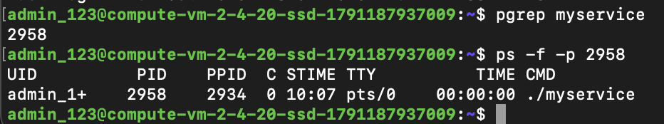

## Часть 3 — cgroups

Спева мы навесили ограничения по памяти и проверили их работу. При попытке занять больше память, чем разрешено, процесс был убит
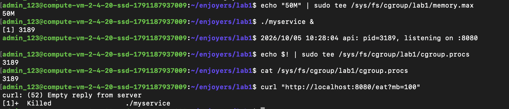

Затем мы внесли ограничения на cpu. В данной ситуации процесс не убивается при пиковой нагрузке, но появляется троттлинг 
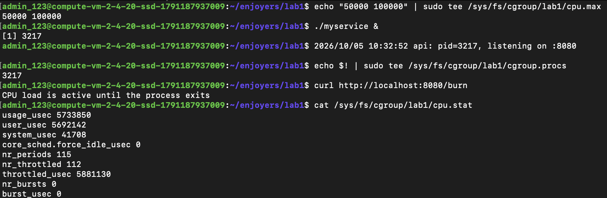

Долго разбирались, как именно можно протестировать ограничения на количество процессов. Внесли ограничения, запускали ```bash stress-ng --fork```, но результат был странным. При ограничении в 10 количество fork упирался в 2 и все, за 10 минут нет изменений. Потом мы разобрались и смогли получить актуальное количество запущенных процессов и количество попыток создать новые
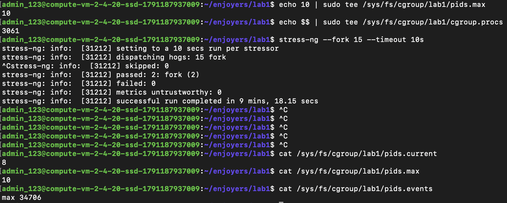

## Часть 4 — права

Для демонстрации работы capabilities испльзовалася ping с разными значениями параметра --caps=. При отсутсвии нужного capabilities даже sudo не поможет выполнить команду
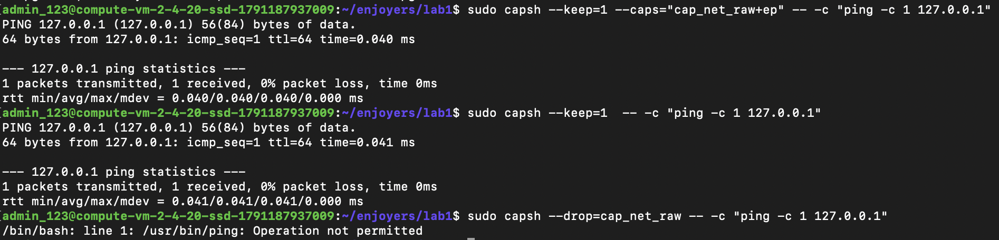

Дальше был написал скрипт на С. Не без помощи агентов, и не с первого раза, но он собрался. В нем была добавлена одна фильтрация - команда mkdir. Дальше в качестве теста спера была использована эта команда без обертки, а затем с оберткой.
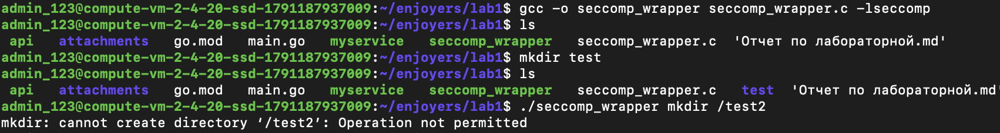

## Часть 5 — Сбор своего Docker

Далее мы объединили все команды, использованные ранее, в один скрипт [файл](./mydocker.sh)

Сперва запутались в PID и изоляции. Но потом разобрались и скрипт отработал успешно, сервис поднялся
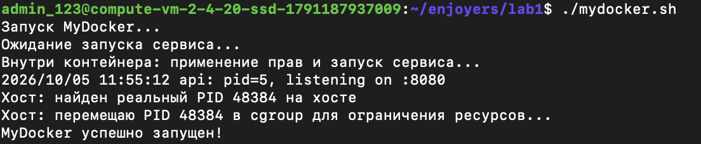

Для проверки отправили несколько запросов. Все отработало как и ожидалось: health вернул ok, а при превышении лимита памяти процесс убивается
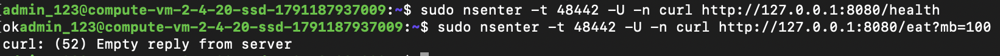
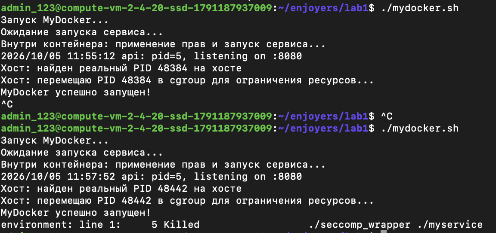

Теперь сравним это с запуском docker run:
``` bash
docker run --rm --name myservice-docker \
  --memory=50m --cpus=0.5 --pids-limit=100 \
  --cap-drop=ALL --security-opt no-new-privileges \
  -p 8080:8080 \
  -v "$PWD/myservice":/myservice:ro \
  debian:bookworm-slim /myservice
```

Docker берет на себя всю сложную настройку: изолирует файловую систему, автоматически разворачивает сетевой мост для внешнего доступа вместо работы с пустым флагом --net, и предоставляет удобный единый интерфейс для пользователя.

## Часть 6 — Образы

Сперва собираем обычный образ с помощью [файл](./Dockerfile)
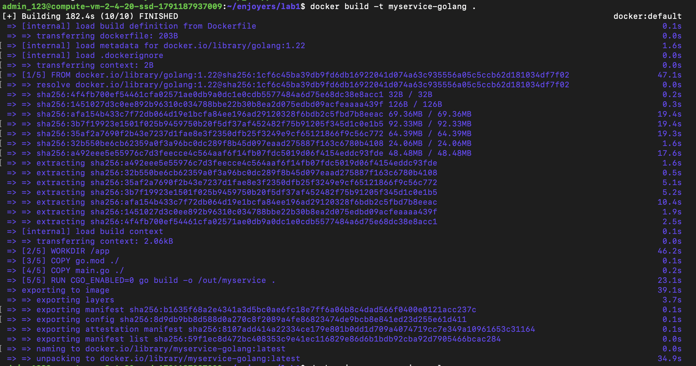

Затем с помощью нового [Dockerfile](./Dockerfile.multi) собираем multistage
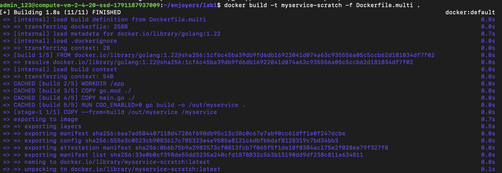

Далее сравниваем два образа по объему и количеству слоев
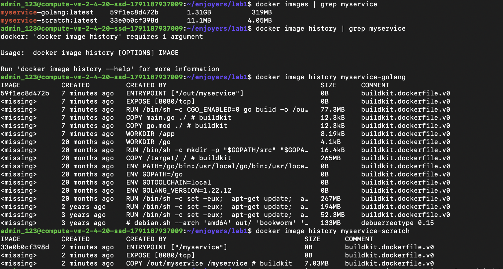


Multistage не просто уменьшает вес получаемого образа, он еще и не тянет за собой компилятор, пакеты и различные утилиты. Тем самым образ становится чище.

Теперь попробуем добавить файл в контейнер, не подключая том.
При перезапуске контейнера файл пропал
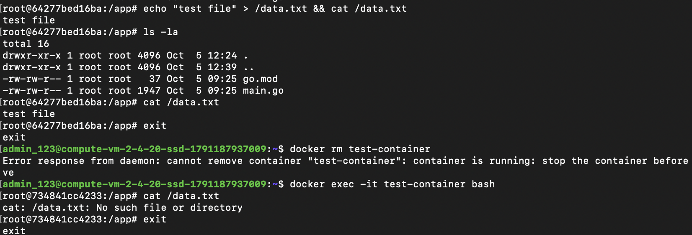

Но если мы подключим папку на хосте в качетве тома, то файл никуда не пропадет
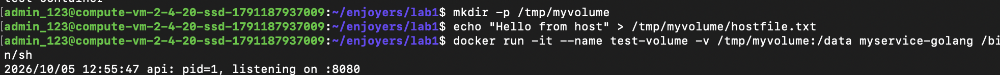
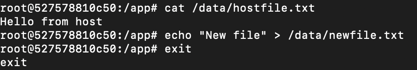
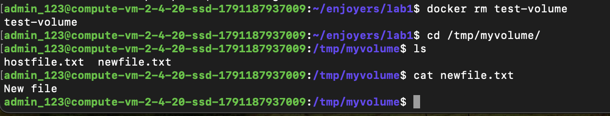

## Часть 7 — Гипервизор

gVisor - это песочница, которая ставится в Docker вместо привычного runc и изолирует контейнер, подменяя собой часть работы с ядром хоста.

Настройка: ставим runsc и регистрируем его как доступный рантайм. Базовым рантаймом в системе останется runc, но у нас появится возможность точечно включать gVisor с помощью флага --runtime=runsc.

После запуска получили ok от сервиса.

Отвечая на вопрос: "Что у обычного контейнера остаётся общим с хостом в любом случае?" - мы приходим к основной особенности работы gVisor к тому, почему его считают более изолированным и защищенным. 

gVisor внедряет дополнительный уровень абстракции. Вместо прямого обращения к ядру хоста, контейнер общается с Sentry (user-space kernel, написанный на Go), который эмулирует поверхность системных вызовов Linux. Sentry, в свою очередь, делает ограниченный набор безопасных вызовов к реальному ядру хоста.

Для подтверждения этих выводов были сделаны проверки 
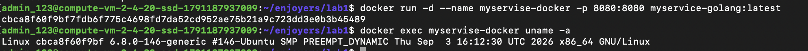
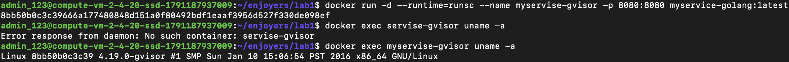

Как мы видим результат команды показал разные ядра.

## Часть 8 — Мониторинг

Здесь был настроен мониторинг работы контейнера.

Сперва был создан [docker-compose](./docker-compose.monitoring.yml) для удобного развертывания стека мониторинга. Затем был поднят наш сервис
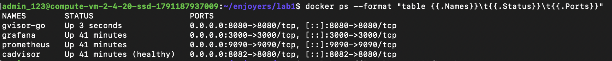

На порту 3000 нас встречает интерфейс Grafana.

Далее был создан дашборд с 3 графиками и на каждый график был создан алерт

Графики:
* Memory Usage (использование RAM). мониторинг RAM позволяет отслеживать объем используемой памяти и не допускать падения сервиса по OOM. Для этого также был настроен алерт на достижение 90% лимита.
* CPU Usage (использование CPU). мониторинг CPU позволяет следить за возможными появлениями троттлинга, из-за которого будет тормозить сервис. Также был настроен алерт по аналогии с RAM.
* Network (использование сети). Этот график показывает скорость входящего сетевого трафика (в байтах в секунду). Также был настроен алерт по аналогиис RAM.

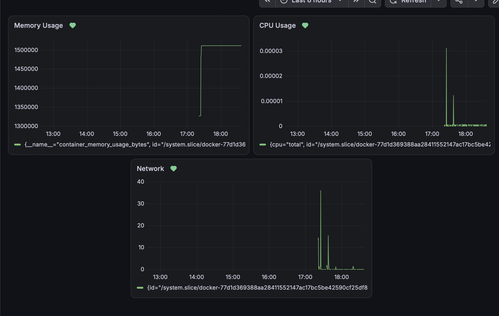
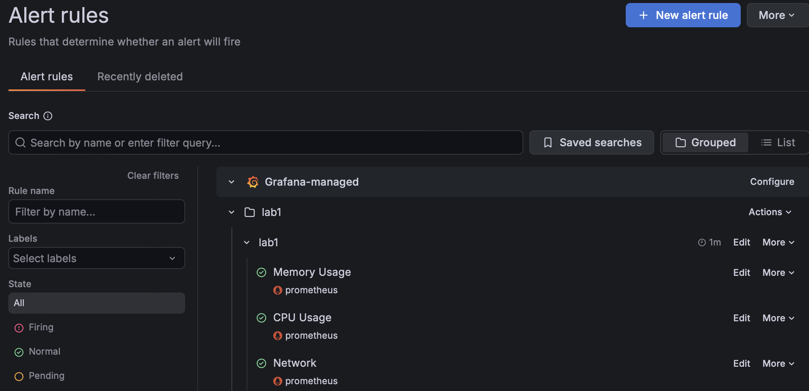