# Лабораторная работа № 2. Наблюдаемость HTTP-сервиса

Метрики, журналы, трассировки и оповещения сервиса `api` в локальном кластере Kubernetes.

## Содержание

1. [Подготовка рабочей среды](#1-подготовка-рабочей-среды)
2. [HTTP-сервис и развёртывание в Kubernetes](#2-http-сервис-и-развёртывание-в-kubernetes)
3. [Метрики: Prometheus и Grafana](#3-метрики-prometheus-и-grafana)
4. [Журналы: Loki и Grafana Alloy](#4-журналы-loki-и-grafana-alloy)
5. [Трассировки: OpenTelemetry и Jaeger](#5-трассировки-opentelemetry-и-jaeger)
6. [Оповещения: Prometheus и Alertmanager](#6-оповещения-prometheus-и-alertmanager)
7. [Отображение оповещений в Karma](#7-отображение-оповещений-в-karma)
8. [Доставка уведомлений через webhook](#8-доставка-уведомлений-через-webhook)
9. [Итоговая проверка стенда](#9-итоговая-проверка-стенда)
10. [Заключение](#10-заключение)

## 1. Подготовка рабочей среды

Перед развёртыванием были проверены доступность Docker Engine, версия Helm и подключение к локальному кластеру Kubernetes, созданному с помощью kind. Узел lab2-control-plane находился в состоянии Ready и выполнял роль control-plane. Версия Kubernetes на узле - v1.37.0.

*Рисунок 1 - Проверка версий клиента и сервера Docker*

*Рисунок 2 - Список локальных кластеров kind*

*Рисунок 3 - Проверка версии Helm*

*Рисунок 4 - Проверка текущего контекста kubectl*

*Рисунок 5 - Проверка готовности узла кластера kind-lab2*

## 2. HTTP-сервис и развёртывание в Kubernetes

### 2.1. Реализация и сборка образа

Для стенда был подготовлен HTTP-сервис api на Go. Из предыдущей версии приложения был перенесён обработчик `/health`. Обработчик `/fail` возвращает серверную ошибку, `/slow` добавляет задержку, а `/load` создаёт пакет HTTP-запросов. Сервис публикует метрики Prometheus, записывает структурированные журналы в формате JSON и формирует трассировки OpenTelemetry.

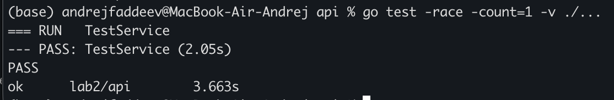

*Рисунок 6 - Результат автоматической проверки сервиса api*

Для запуска сервиса в контейнерной среде был собран образ `lab2-api:0.1.0`. Сборка выполнялась по Dockerfile в два этапа: сначала приложение компилировалось в среде Go, затем исполняемый файл переносился в итоговый образ без компилятора и исходного кода. Для запуска приложения был указан пользователь без прав root. После завершения сборки наличие образа было проверено командой docker image ls.

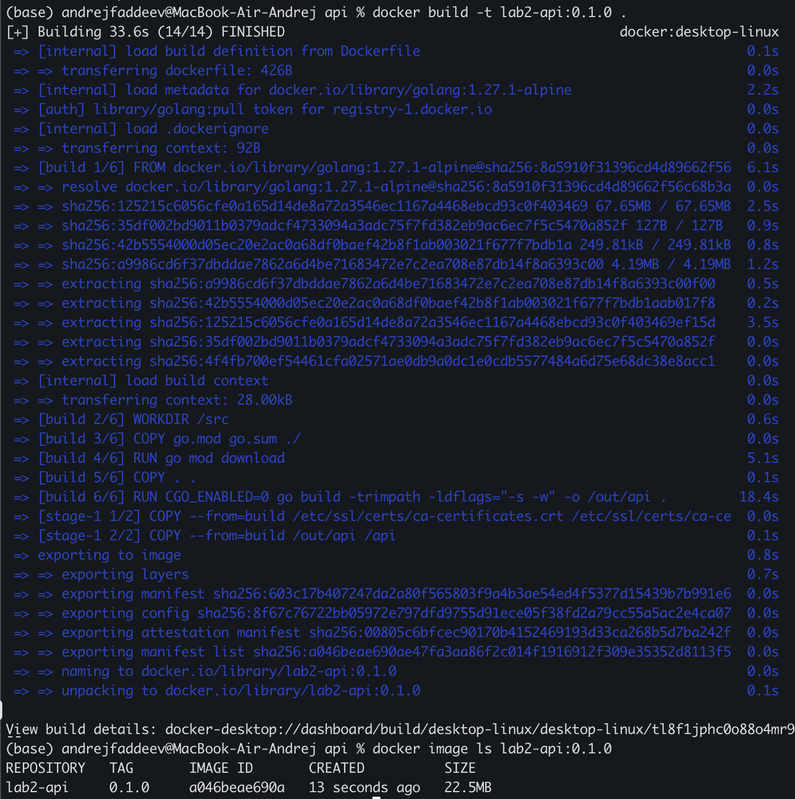

*Рисунок 7 - Результат сборки контейнерного образа сервиса api*

Собранный образ `lab2-api:0.1.0` был загружен в локальный кластер kind с помощью команды kind load docker-image. Это обеспечило доступность образа для запуска приложения без обращения к внешнему реестру. После загрузки командой crictl images было проверено наличие образа с тегом 0.1.0 в среде выполнения контейнеров узла lab2-control-plane.

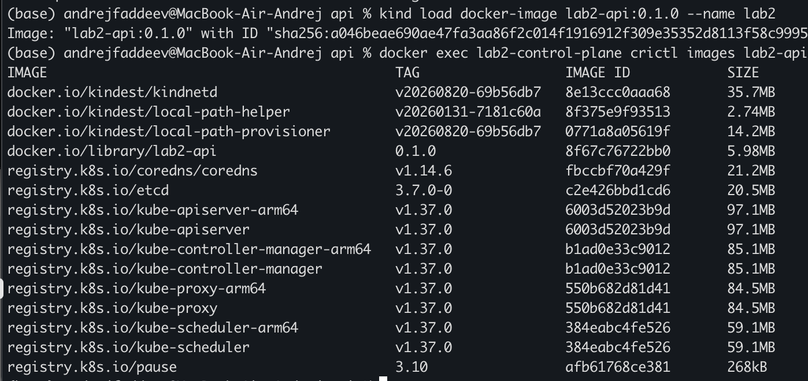

*Рисунок 8 - Проверка наличия образа сервиса api на узле кластера kind*

### 2.2. Helm-чарт и запуск приложения

Для подготовки развёртывания приложения была создана заготовка Helm-чарта api. Команда helm create сформировала файл описания чарта `Chart.yaml`, файл параметров `values.yaml` и каталог шаблонов ресурсов Kubernetes. Корректность созданной заготовки была проверена командой helm lint. Проверка завершилась без ошибок. Helm-чарт был настроен для развёртывания сервиса api. В параметрах были указаны образ `lab2-api:0.1.0`, политика загрузки `IfNotPresent` и порт 8080. Для проверок работоспособности и готовности приложения был задан HTTP-путь `/health`. После изменения параметров чарт был проверен командой helm lint, а сформированное описание Deployment было просмотрено с помощью helm template.

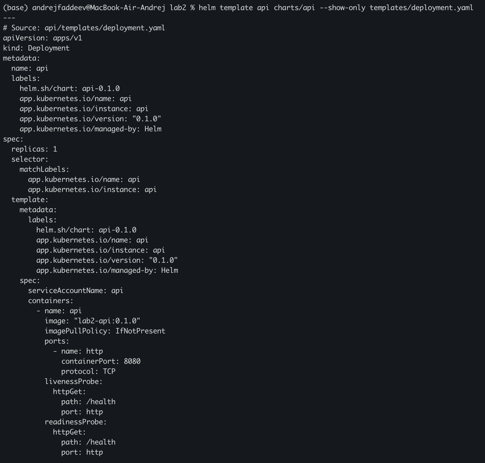

*Рисунок 9 - Параметры контейнера и проверки состояния сервиса api в Helm-чарте*

Сервис api был развёрнут в кластере kind-lab2 с помощью подготовленного Helm-чарта. Для ресурсов приложения было создано пространство имён lab2. После установки были проверены Deployment, Pod и Service. Deployment имел одну доступную реплику, а Pod находился в состоянии Running с готовым контейнером. Для доступа к приложению внутри кластера был создан Service типа ClusterIP с портом 8080.

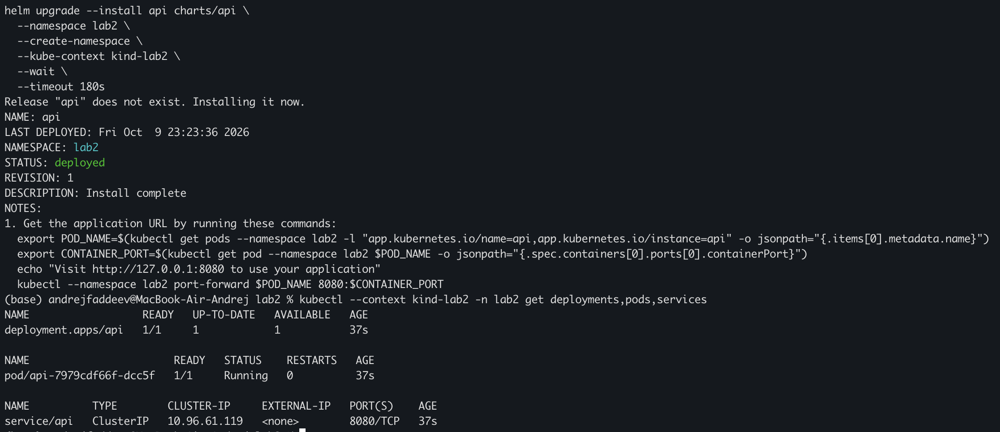

*Рисунок 10 - Результат развёртывания сервиса api в Kubernetes через Helm*

### 2.3. Проверка обработчиков, метрик и журналов

Для проверки приложения из локального терминала было настроено перенаправление порта 18080 на порт 8080 сервиса api в Kubernetes. Запрос к `/health` вернул код HTTP 200 и ответ ok. Обращение к `/fail` привело к предусмотренной приложением ошибке HTTP 500. Обработчик `/slow` вернул успешный ответ с задержкой около двух секунд.

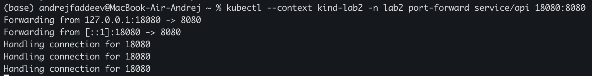

*Рисунок 11 - Перенаправление локального порта на Service api в Kubernetes*

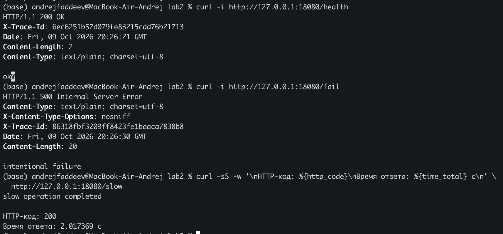

*Рисунок 12 - Проверка доступности, генерации ошибки и задержки ответа сервиса api*

С помощью обработчика `/load` был сформирован пакет из 100 HTTP-запросов к обработчику `/health`. Все запросы пакета завершились успешно. Затем через `/metrics` были получены метрики приложения в формате Prometheus. В выводе присутствовали счётчики обработанных запросов и ошибок, а также количество и суммарная длительность обращений к `/slow`.

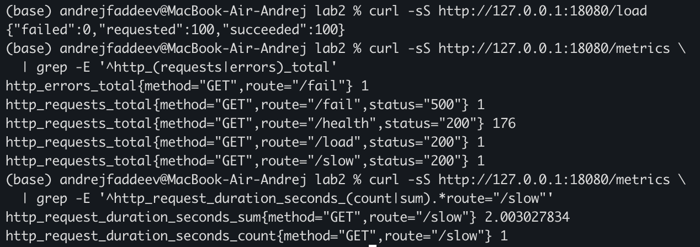

*Рисунок 13 - Проверка генерации нагрузки и метрик сервиса api*

Для проверки журналирования был повторно вызван обработчик `/fail`. С помощью команды kubectl logs была получена запись об ошибочном запросе в формате JSON. Запись содержала уровень ERROR, путь `/fail`, код ответа 500, длительность обработки и идентификатор `trace_id`. Идентификатор в журнале совпал со значением заголовка `X-Trace-Id` в HTTP-ответе.

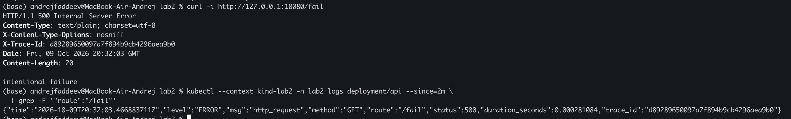

*Рисунок 14 - Сопоставление ошибочного HTTP-запроса с записью в JSON-журнале*

## 3. Метрики: Prometheus и Grafana

### 3.1. Установка стека и сбор метрик

Для подготовки системы мониторинга был подключён репозиторий Helm prometheus-community. После обновления сведений о доступных чартах был найден kube-prometheus-stack, предназначенный для развёртывания компонентов мониторинга Kubernetes. Была определена доступная версия чарта для последующей установки. В пространстве имён monitoring был развёрнут стек мониторинга с использованием Helm-чарта kube-prometheus-stack версии 92.2.0. Были установлены Prometheus, Grafana, Alertmanager и вспомогательные компоненты. Интервалы сбора метрик и вычисления правил были заданы равными 15 секундам, срок хранения метрик - 24 часам. Для Grafana и Prometheus были настроены отдельные тома хранения данных. После установки были проверены готовность Pod и выделение томов.

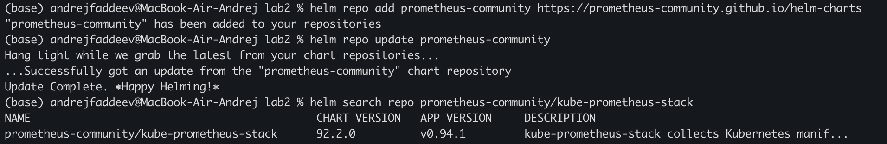

*Рисунок 15 - Подключение репозитория мониторинга, определение доступной версии чарта для установки*

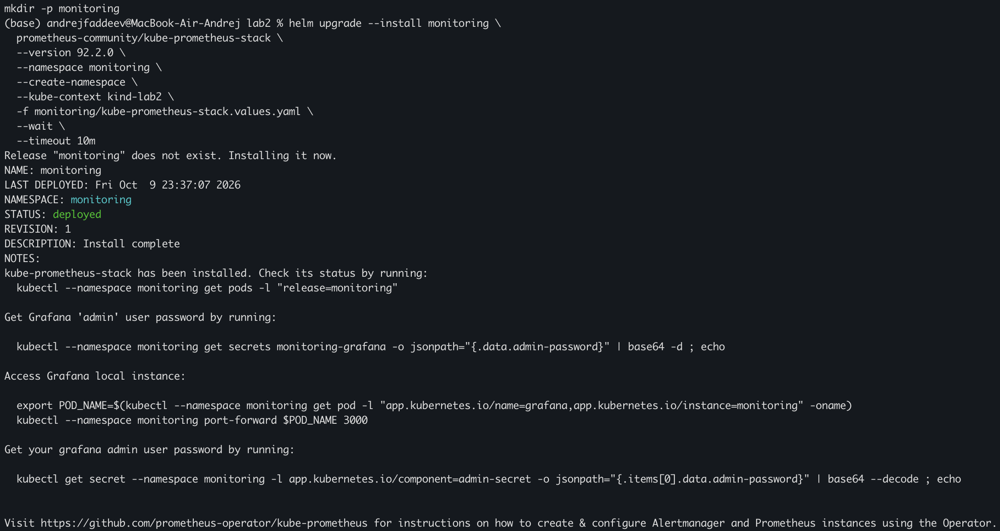

*Рисунок 16 - Установка мониторинга*

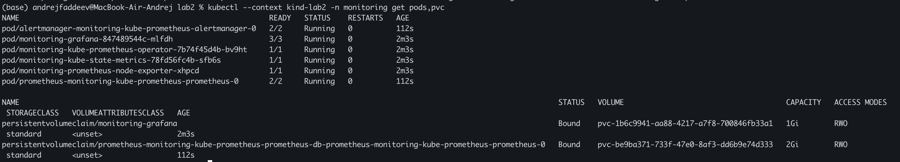

*Рисунок 16 - Результат установки компонентов мониторинга и выделения томов хранения*

В Helm-чарт приложения был добавлен объект ServiceMonitor для настройки сбора метрик. В качестве источника был указан Service api, выбираемый по меткам приложения и установки Helm. Для опроса был задан путь `/metrics` на порту с именем http и интервал 15 секунд. После обновления установки Helm было проверено наличие ServiceMonitor и соответствие его параметров подготовленной конфигурации.

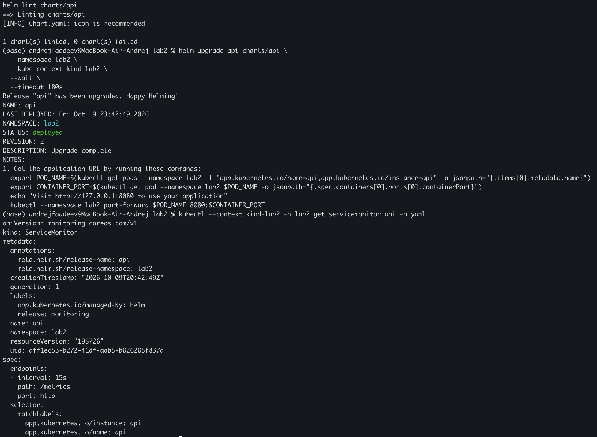

*Рисунок 17 - Добавление объекта с правилами выбора Service, адресом метрик и интервалом опроса*

После создания ServiceMonitor была проверена фактическая передача метрик в Prometheus. Для доступа к веб-интерфейсу было настроено перенаправление локального порта 19090 на порт 9090 сервиса Prometheus. Запрос up с фильтрами пространства имён lab2 и сервиса api вернул значение 1. Дополнительно запросом `http_requests_total` было проверено наличие счётчиков HTTP-запросов сервиса.

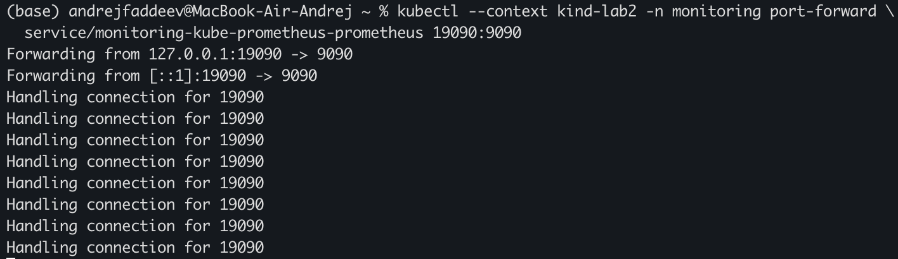

*Рисунок 18 - Перенаправление локального порта для доступа к Prometheus*

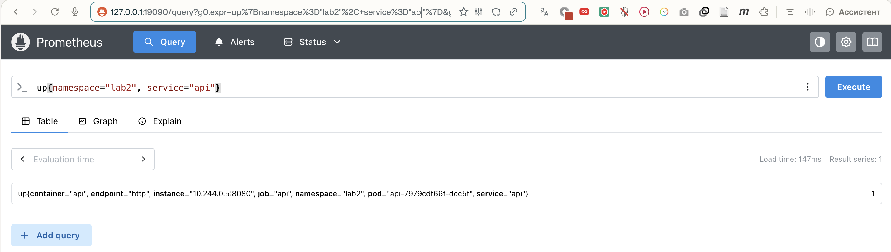

*Рисунок 19 - Проверка успешного опроса сервиса api в Prometheus*

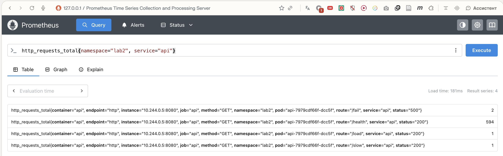

*Рисунок 20 - Счётчики HTTP-запросов сервиса api в Prometheus*

### 3.2. Подключение Grafana

Для доступа к Grafana было настроено перенаправление локального порта 13000 на порт 80 сервиса monitoring-grafana. Учётные данные администратора были получены из объекта Secret в пространстве имён monitoring. После авторизации была открыта главная страница Grafana.

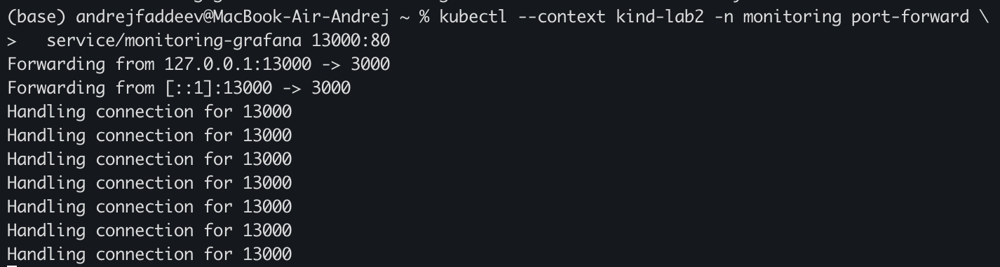

*Рисунок 21 - Настройка доступа к веб-интерфейсу Grafana*

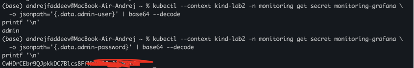

*Рисунок 22 - Получение учётных данных Grafana*

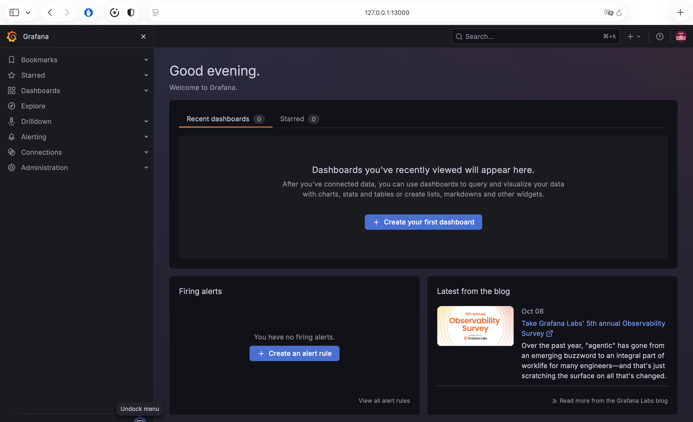

*Рисунок 23 - Веб-интерфейс Grafana после авторизации*

В Grafana был проверен источник данных Prometheus, созданный при установке Helm-чарта. Подключение использует внутренний адрес сервиса Prometheus в Kubernetes. Проверка соединения завершилась успешно.

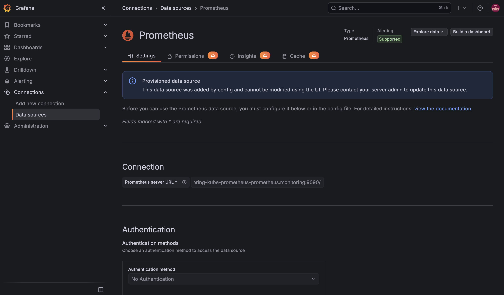

*Рисунок 24 - Источник данных Prometheus в Grafana *

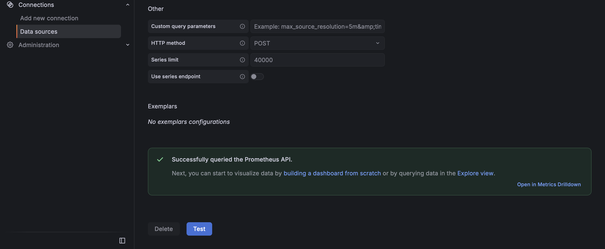

*Рисунок 25 - Проверка подключения Grafana к источнику данных Prometheus*

### 3.3. Панели RED

В Grafana был создан дашборд «API - RED» и добавлена панель частоты HTTP-запросов - компонента Rate подхода RED. Источник данных - накопительный счётчик `http_requests_total`. Его абсолютное значение не отражает текущую нагрузку, поэтому запрос использует функцию rate с окном в одну минуту. Суммирование по обработчикам и кодам ответа даёт общую частоту запросов в секунду. Минутное окно позволяет наблюдать кратковременные изменения нагрузки. Расчёт включает регулярные проверки `/health` со стороны Kubernetes.

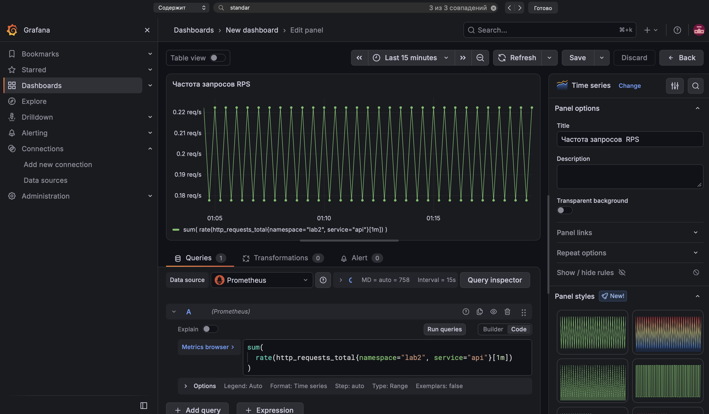

*Рисунок 26 - Настройка панели частоты HTTP-запросов в Grafana*

На дашборд была добавлена панель доли серверных ошибок - компонента Errors подхода RED. Показатель рассчитывается как отношение частоты HTTP-ответов с кодами 5xx к общей частоте запросов за последнюю минуту и отображается в процентах. Он характеризует распространённость ошибок с учётом количества обращений к сервису. В расчёт входят и проверки `/health` со стороны Kubernetes. На показанном временном интервале доля серверных ошибок составляла 0%.

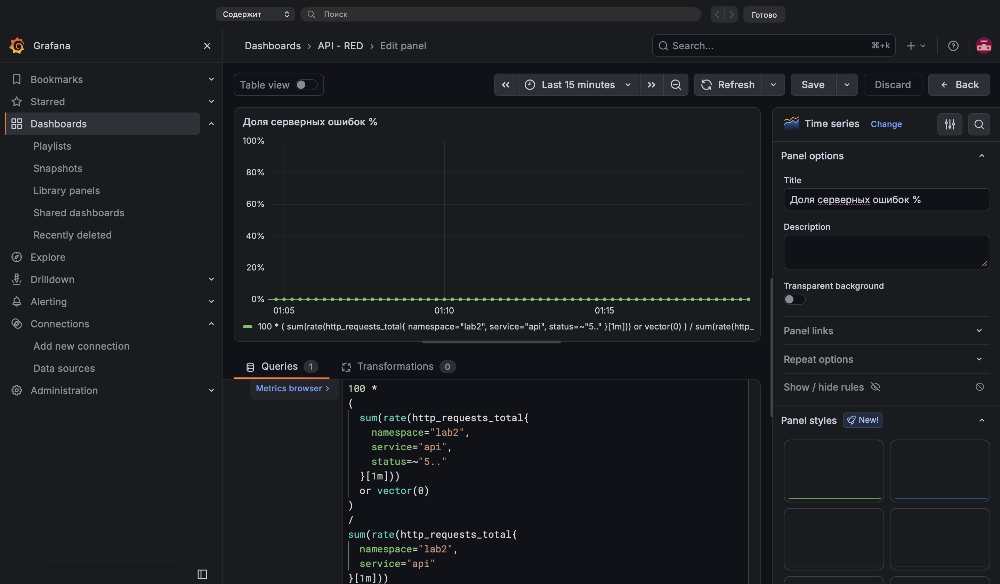

*Рисунок 27 - Настройка панели доли серверных ошибок в Grafana*

Для оценки задержек была добавлена панель 95-го перцентиля времени обработки запросов - компонента Duration подхода RED. Функция histogram_quantile рассчитывает p95 по гистограмме `http_request_duration_seconds_bucket` за последнюю минуту. Данные обработчиков суммируются с сохранением границ бакетов. Перцентиль характеризует верхнюю границу времени обработки примерно 95% запросов и помогает отслеживать медленные ответы. Это приближённая оценка: её точность зависит от границ бакетов. На показанном интервале p95 составлял около 4,75 мс. Верхняя граница первого бакета - 5 мс, поэтому точные длительности быстрых запросов внутри него по этой гистограмме определить нельзя.

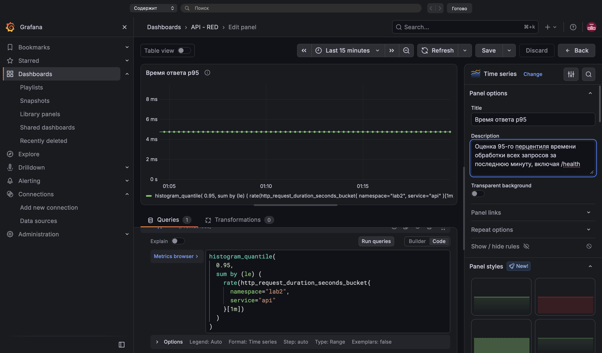

*Рисунок 28 - Настройка панели 95-го перцентиля времени ответа сервиса api*

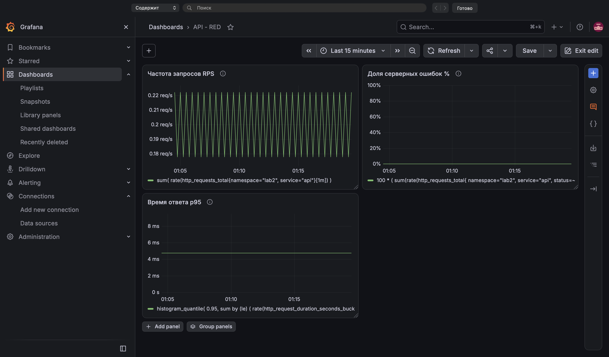

*Рисунок 29 - Дашборд RED сервиса api до генерации тестовой нагрузки*

### 3.4. Реакция графиков на нагрузку, ошибки и задержку

Вызов `/load` сформировал пакет из 100 запросов к `/health`. Все запросы завершились успешно. На панели RPS частота обращений выросла примерно до 2,4 запроса в секунду, затем вернулась к фоновому уровню. Доля серверных ошибок оставалась нулевой. Продолжительность подъёма на графике зависит в том числе от минутного окна расчёта функции rate.

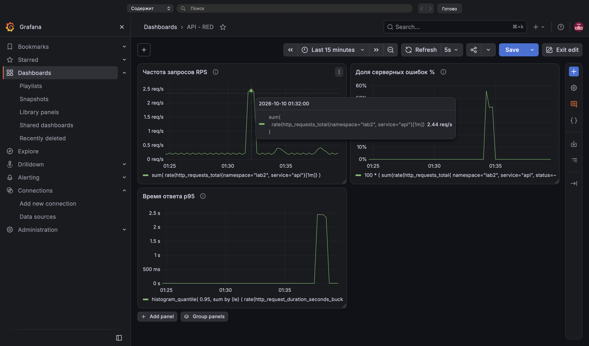

*Рисунок 30 - Реакция дашборда RED на генерацию нагрузки через /load*

Были выполнены десять обращений к `/fail` с интервалом приблизительно в одну секунду. Каждый запрос вернул HTTP 500. На панели доли серверных ошибок показатель вырос примерно до 55%, а после выхода этих запросов из минутного окна расчёта вернулся к нулю. Заметного изменения p95 на графике не наблюдалось.

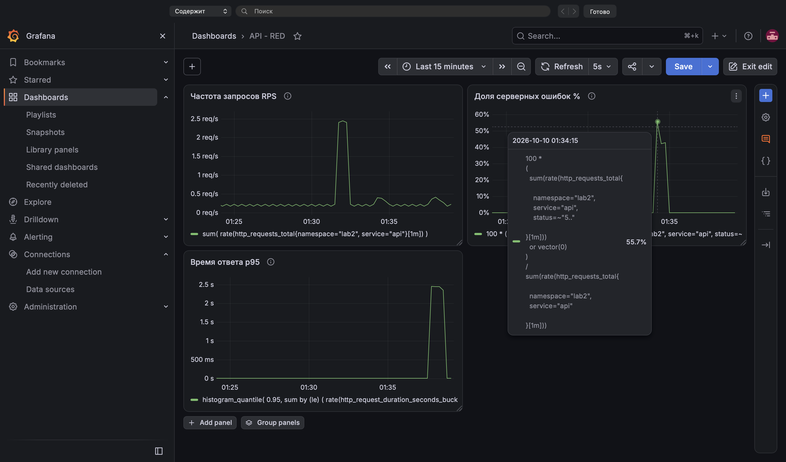

*Рисунок 31 - Реакция дашборда RED на серверные ошибки, созданные через /fail*

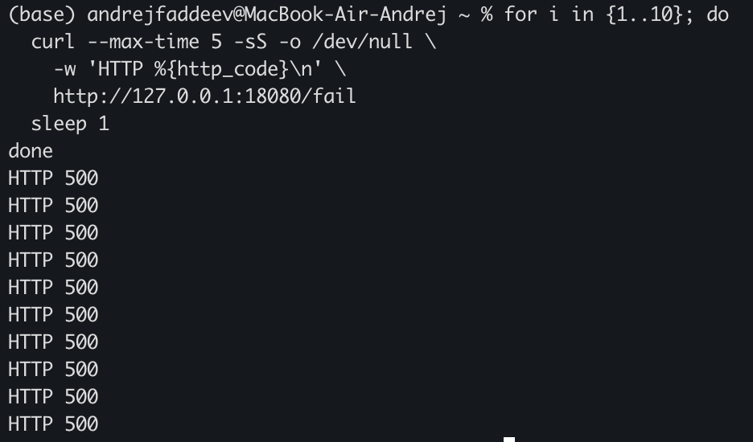

*Рисунок 32 - Генерация серверных ошибок через /fail*

Были последовательно выполнены десять обращений к `/slow`. Запросы завершились с HTTP 200; время каждого ответа составляло около двух секунд. В выбранной точке графика оценка p95 достигла 2,45 с, а доля серверных ошибок оставалась нулевой. Отличие p95 от заданной задержки связано с приближённым расчётом по бакетам гистограммы.

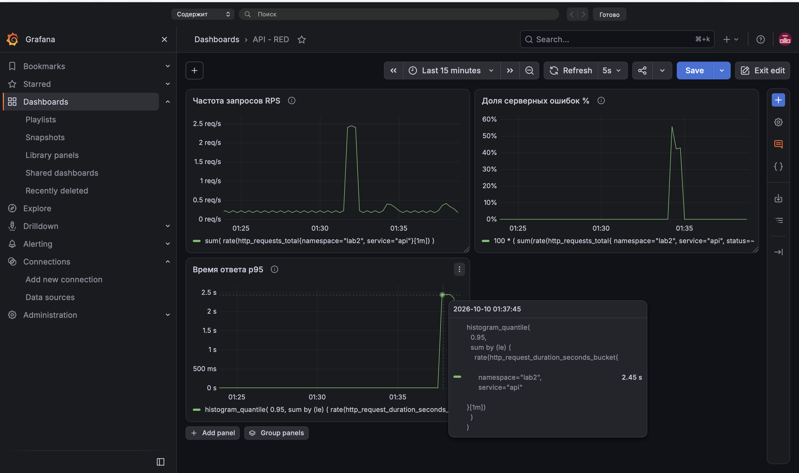

*Рисунок 33 - Реакция дашборда RED на задержку обработки запросов через /slow*

### 3.5. Сохранение дашборда в Helm-чарте

После проверки реакции панелей на нагрузку, ошибки и задержки конфигурация дашборда «API - RED» была сохранена и экспортирована в файл `api-red.json`. Файл содержит настройки визуализаций и запросы к Prometheus.

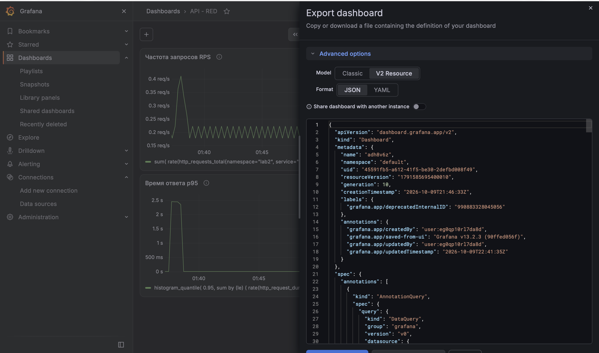

*Рисунок 34 - Экспорт конфигурации дашборда API - RED*

Экспортированная конфигурация дашборда была включена в Helm-чарт приложения. Для её хранения был добавлен объект ConfigMap с меткой grafana_dashboard, предназначенной для обнаружения конфигураций дашбордов. После обновления установки Helm было проверено наличие объекта и сохранение в нём названия дашборда и трёх панелей.

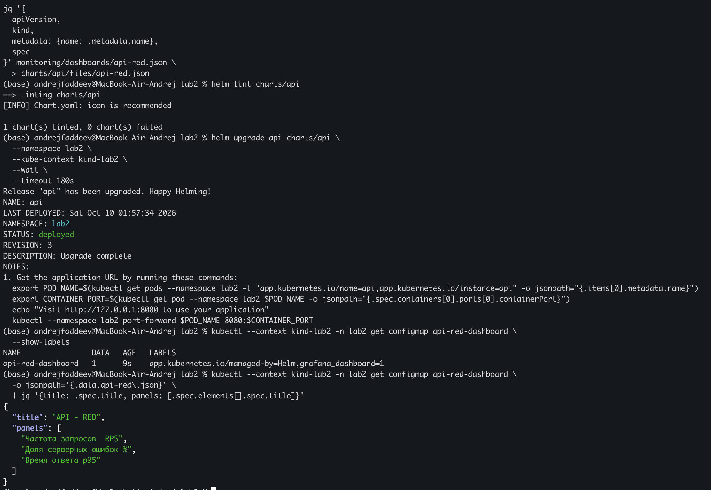

*Рисунок 35 - Развёртывание конфигурации дашборда Grafana через Helm*

После обновления Helm-чарта вспомогательный контейнер Grafana обнаружил конфигурацию дашборда и записал файл `api-red.json`. Затем был автоматически вызван механизм повторной загрузки дашбордов. Grafana вернула ответ HTTP 200, а в журнале появилась запись о завершении загрузки конфигураций.

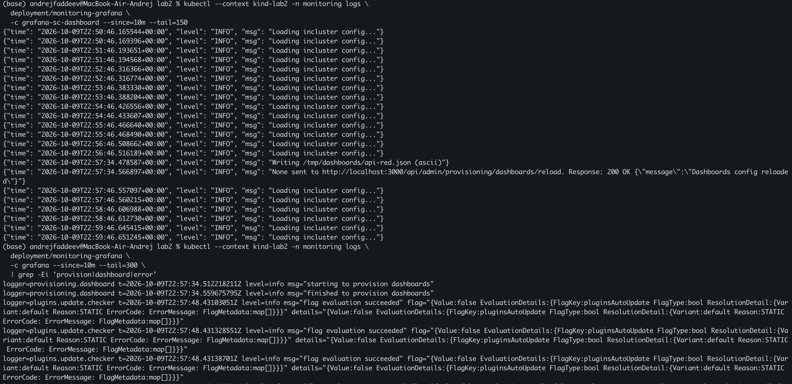

*Рисунок 36 - Проверка автоматической загрузки конфигурации дашборда в Grafana*

## 4. Журналы: Loki и Grafana Alloy

### 4.1. Развёртывание хранилища и агента

Для организации централизованного сбора журналов были выбраны Loki в качестве хранилища и Grafana Alloy в качестве агента сбора. Были подключены соответствующие репозитории Helm, обновлены сведения о чартах и определены их доступные версии для последующего развёртывания.

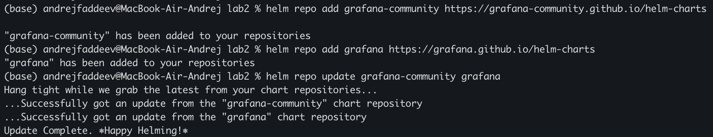

*Рисунок 37 - Подключение репозиториев чартов, обновление сведений о чартах*

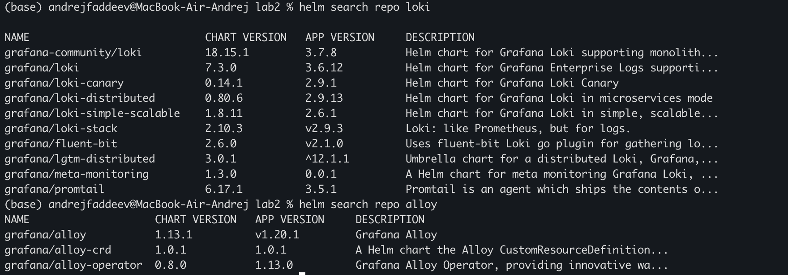

*Рисунок 38 - Выбор Helm-чартов Loki и Grafana Alloy*

В пространстве имён monitoring было развёрнуто хранилище журналов Loki версии 3.7.8 с использованием Helm-чарта версии 18.15.1. Для локального стенда был выбран монолитный режим с одним экземпляром и хранением данных в файловой системе на отдельном томе объёмом 2 гигабайта. После установки были проверены готовность компонентов, наличие сервисов и выделение тома хранения.

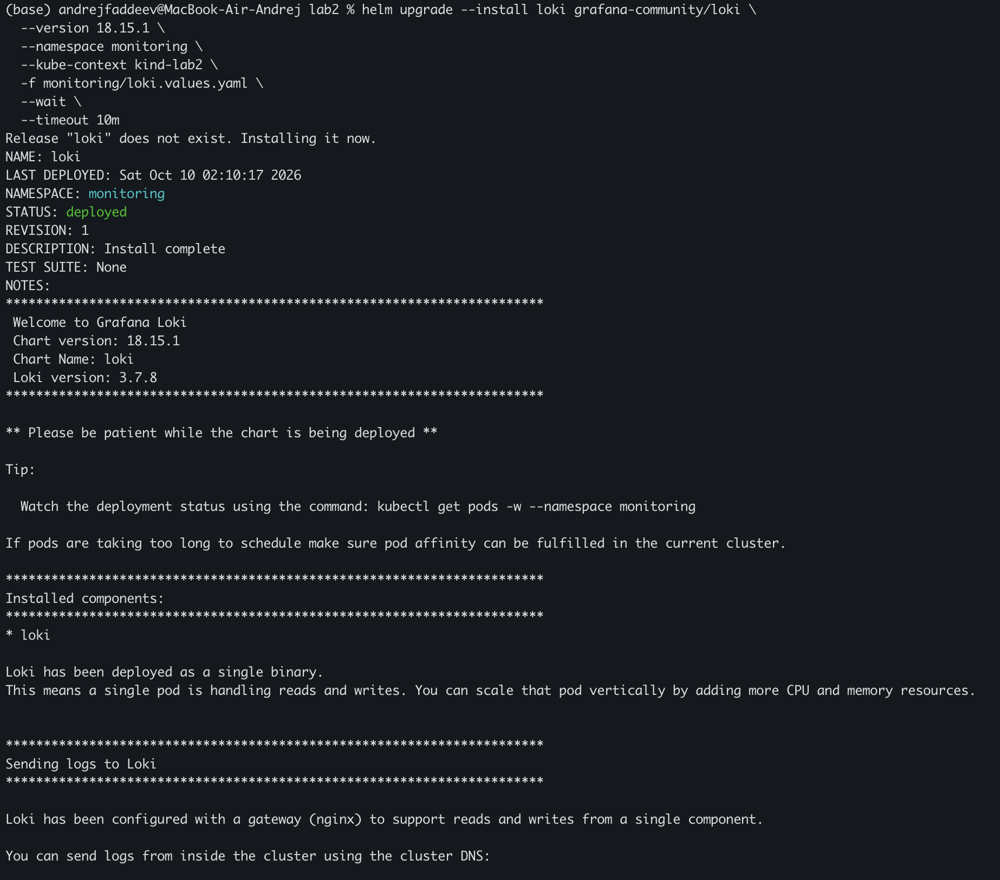

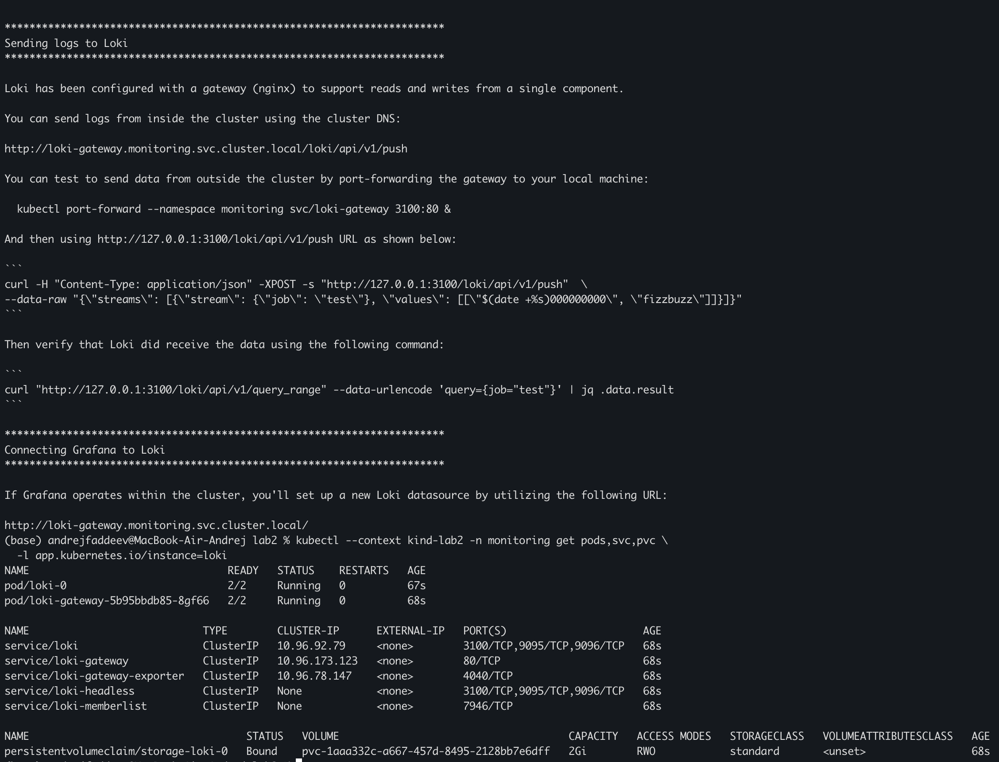

*Рисунок 39 - Результат развёртывания Loki и выделения тома хранения журналов*

Через Helm-чарт версии 1.13.1 был установлен агент Grafana Alloy. Для размещения агента на узлах Kubernetes использовался DaemonSet. В конфигурации был задан сбор файлов журналов контейнера api из пространства имён lab2. Перед отправкой в Loki агент удаляет служебную оболочку CRI и добавляет метки для поиска. После установки была проверена готовность DaemonSet и Pod агента.

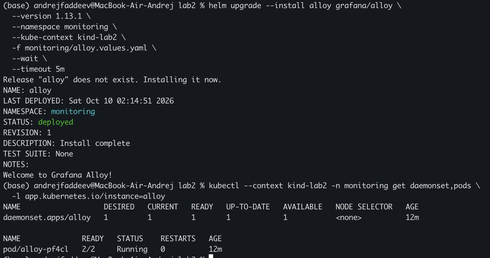

*Рисунок 40 - Развёртывание агента Grafana Alloy для сбора журналов приложения*

### 4.2. Подключение Loki и поиск ошибок

В конфигурацию Helm-чарта системы мониторинга был добавлен источник данных Loki. Для подключения использовался внутренний адрес сервиса loki-gateway в пространстве имён monitoring. После обновления установки источник появился в Grafana. Проверка соединения в Grafana завершилась успешно.

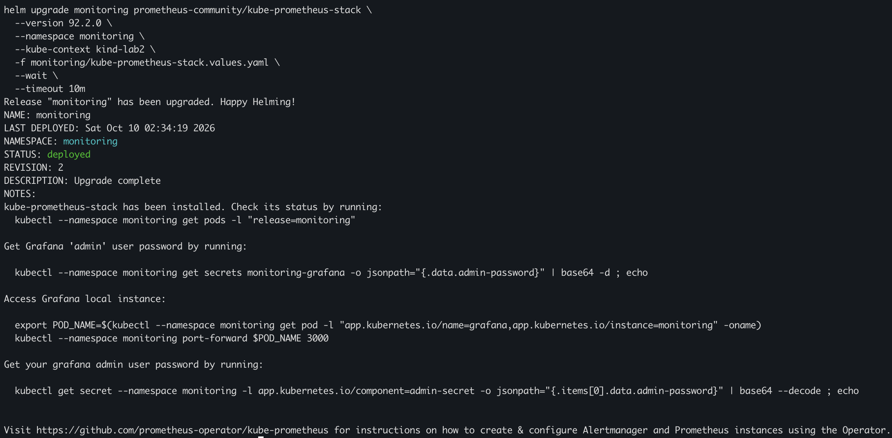

*Рисунок 42 - Обновление релиза мониторинга после добавления источника Loki*

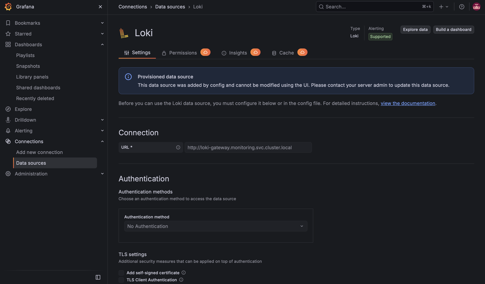

*Рисунок 43 - Проверка подключения Loki в Grafana*

После запроса к `/fail` в разделе Explore Grafana была найдена соответствующая запись в Loki. Запрос фильтровал журналы по пространству имён lab2, сервису api, маршруту `/fail` и коду ответа 500. JSON-запись содержала уровень ERROR, длительность обработки и `trace_id`. Идентификатор совпал со значением заголовка `X-Trace-Id` в HTTP-ответе.

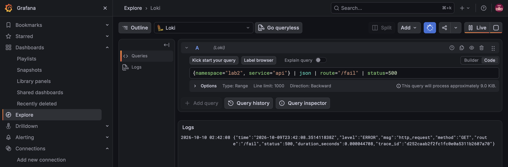

*Рисунок 44 - Поиск записи о серверной ошибке приложения в Loki через Grafana*

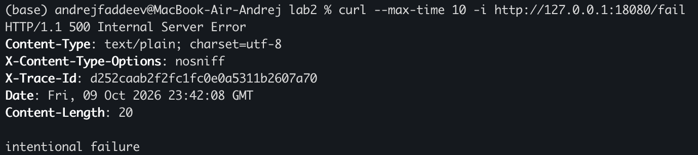

*Рисунок 45 - Отправка запроса /fail*

## 5. Трассировки: OpenTelemetry и Jaeger

### 5.1. Установка Jaeger и настройка экспорта

Для организации просмотра трассировок был подключён официальный репозиторий Helm-чартов Jaeger. После обновления сведений о репозитории был найден чарт jaegertracing/jaeger и определена его доступная версия для последующего развёртывания.

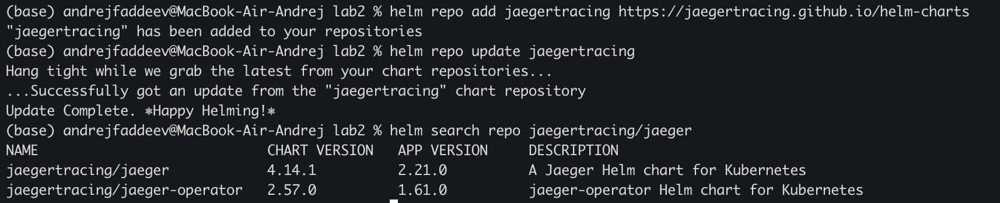

*Рисунок 48 - Выбор Helm-чарта Jaeger для развёртывания системы трассировки*

В пространстве имён monitoring с помощью Helm-чарта jaegertracing/jaeger версии 4.14.1 был развёрнут Jaeger версии 2.21.0. Для локального стенда был настроен один экземпляр приложения с хранением до 10 000 трассировок в оперативной памяти. Был настроен приём данных по протоколу OTLP, включая HTTP на порту 4318. После установки была проверена готовность Deployment, состояние Pod и наличие Service. Pod перешёл в состояние Running, все его контейнеры были готовы к работе.

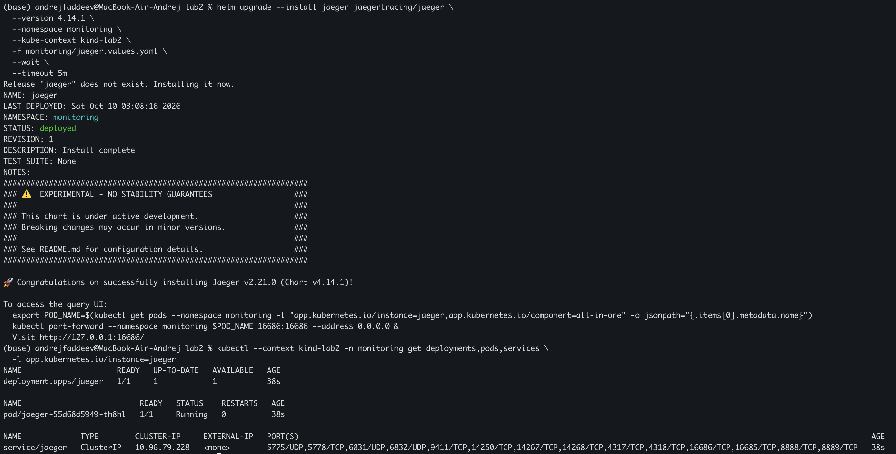

*Рисунок 49 - Развёртывание Jaeger и проверка готовности объектов Kubernetes*

Для доступа к веб-интерфейсу Jaeger было настроено перенаправление локального порта 16686 на соответствующий порт Service в пространстве имён monitoring. В браузере был открыт интерфейс Jaeger.

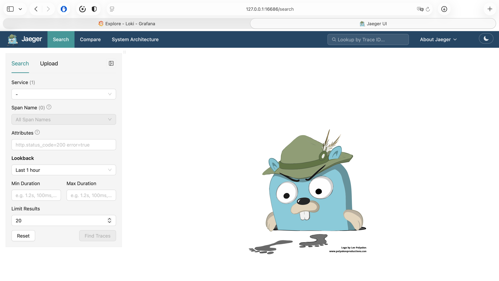

*Рисунок 50 - Веб-интерфейс Jaeger после развёртывания*

В Helm-чарт приложения была добавлена передача переменных окружения для настройки OpenTelemetry. Было задано имя сервиса api и указан внутренний адрес Jaeger для экспорта трассировок по `OTLP/HTTP`. После обновления Helm-релиза Deployment успешно завершил развёртывание. В журнале запуска приложения значение `traces_export_enabled` было равно true.

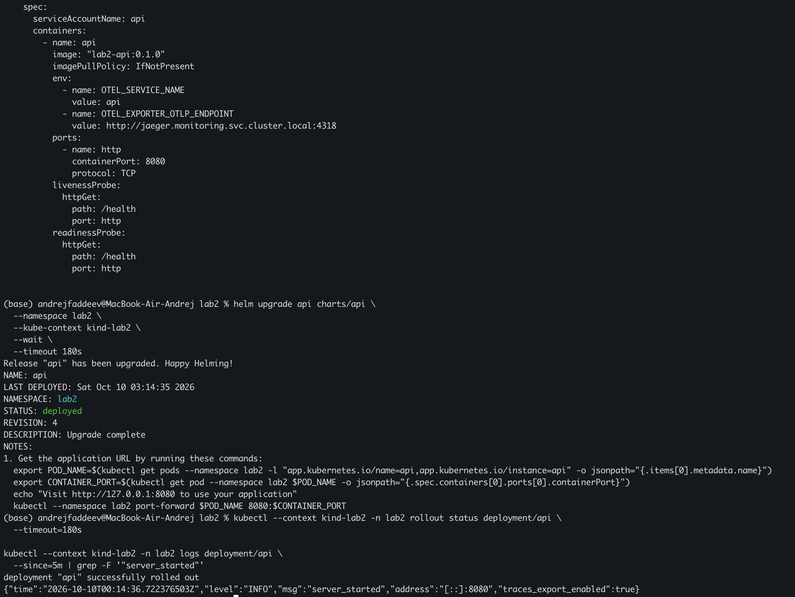

*Рисунок 51 - Включение экспорта трассировок в приложении api*

### 5.2. Медленный и ошибочный запросы

Для проверки передачи трассировок был выполнен запрос к маршруту `/slow`. Приложение вернуло ответ HTTP 200 и идентификатор трассировки в заголовке `X-Trace-Id`. По этому идентификатору трассировка была найдена в Jaeger. На временной диаграмме была отображена вложенная операция `slow-op` длительностью около двух секунд.

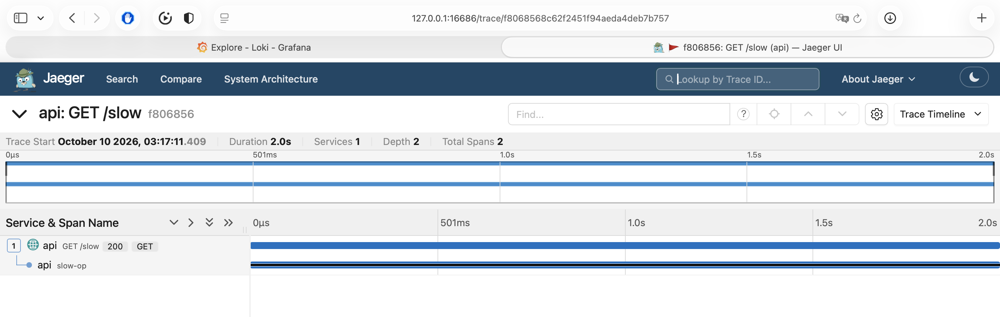

*Рисунок 52 - Трассировка запроса /slow с вложенной операцией slow-op в Jaeger*

Для проверки регистрации ошибок был выполнен запрос к маршруту `/fail`, который намеренно возвращает HTTP 500. По идентификатору из заголовка `X-Trace-Id` соответствующая трассировка была найдена в Jaeger. В подробностях span GET `/fail` отображались HTTP-статус 500 и признак ошибки.

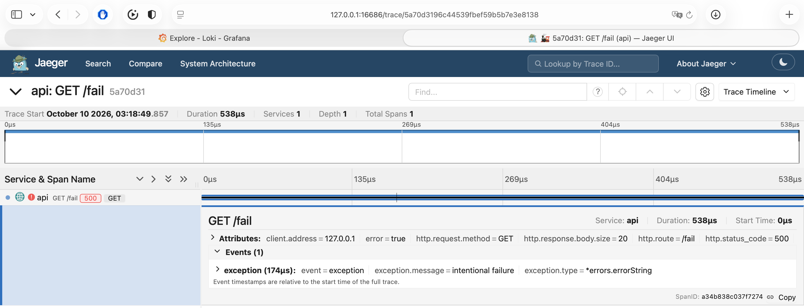

*Рисунок 53 - Трассировка ошибочного запроса /fail в Jaeger*

### 5.3. Связь журналов с трассировками

В Loki по полю `trace_id` была найдена запись об ошибочном запросе `/fail` с уровнем ERROR и HTTP-статусом 500. Тот же идентификатор использовался в Jaeger для трассировки с признаком ошибки и событием exception с сообщением intentional failure. Совпадающий `trace_id` связывает запись журнала с операциями обработки конкретного запроса.

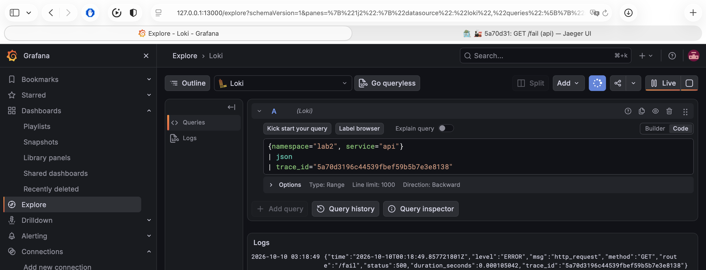

*Рисунок 54 - Поиск журнала ошибочного запроса в Loki по идентификатору трассировки Jaeger*

## 6. Оповещения: Prometheus и Alertmanager

### 6.1. Высокая доля ошибок - ApiHighErrorRate

В Helm-чарт приложения было добавлено правило `ApiHighErrorRate` с уровнем critical. Оно срабатывает, если доля HTTP-ответов 5xx превышает 10% в течение двух минут. Устойчиво высокая доля ошибок означает, что часть запросов не выполняется успешно. При срабатывании следует проверить журналы ERROR в Loki, соответствующие трассировки в Jaeger, последние изменения приложения и состояние его зависимостей.

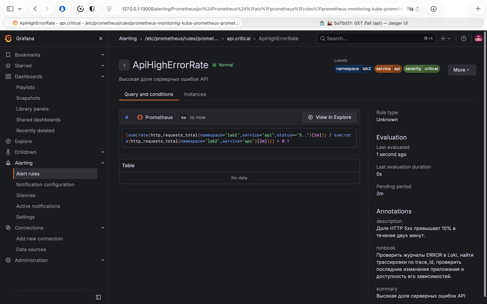

*Рисунок 55 - Просмотр правила ApiHighErrorRate в Grafana*

При последовательном обращении к маршруту `/fail` правило `ApiHighErrorRate` перешло в состояние Firing. На момент проверки расчётная доля серверных ошибок составляла около 83,2%, превышая установленный порог 10%. Условие сохранялось в течение предусмотренного правилом периода ожидания - двух минут.

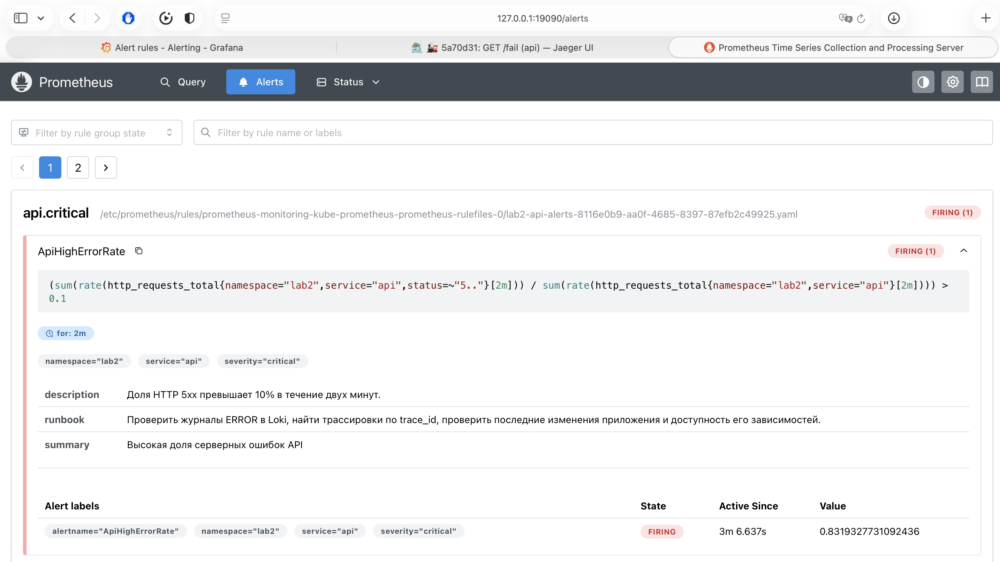

*Рисунок 56 - Срабатывание оповещения ApiHighErrorRate при запросах к /fail*

После срабатывания правила `ApiHighErrorRate` оповещение поступило в Alertmanager. В его интерфейсе были отображены название правила, сервис api, пространство имён lab2 и уровень critical.

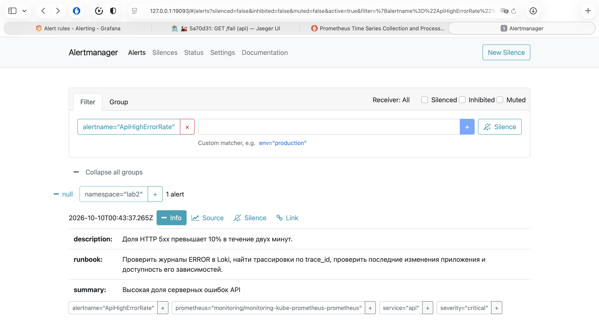

*Рисунок 57 - Оповещение ApiHighErrorRate в Alertmanager*

### 6.2. Высокая задержка - ApiHighLatency

Было добавлено критическое правило `ApiHighLatency`. Оно срабатывает, если p95 времени обработки запросов превышает одну секунду в течение двух минут. Правило обнаруживает ухудшение скорости ответа даже при отсутствии HTTP 5xx. При срабатывании следует найти медленные трассировки в Jaeger, определить длительные вложенные операции и проверить ресурсы приложения и его зависимости.

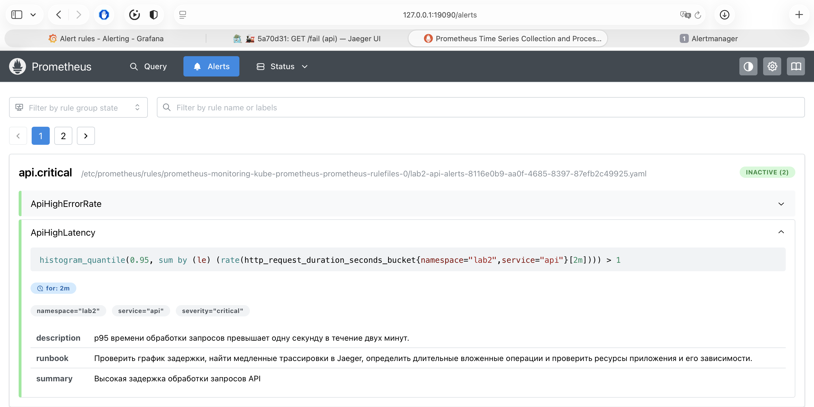

*Рисунок 58 - Правило ApiHighLatency для контроля времени обработки запросов*

Для проверки правила `ApiHighLatency` была сформирована последовательность запросов к маршруту `/slow`. Запросы успешно завершались с HTTP-статусом 200, но содержали искусственную задержку около двух секунд. После устойчивого превышения p95 над порогом одной секунды правило перешло в состояние Firing. Соответствующее оповещение было получено Alertmanager.

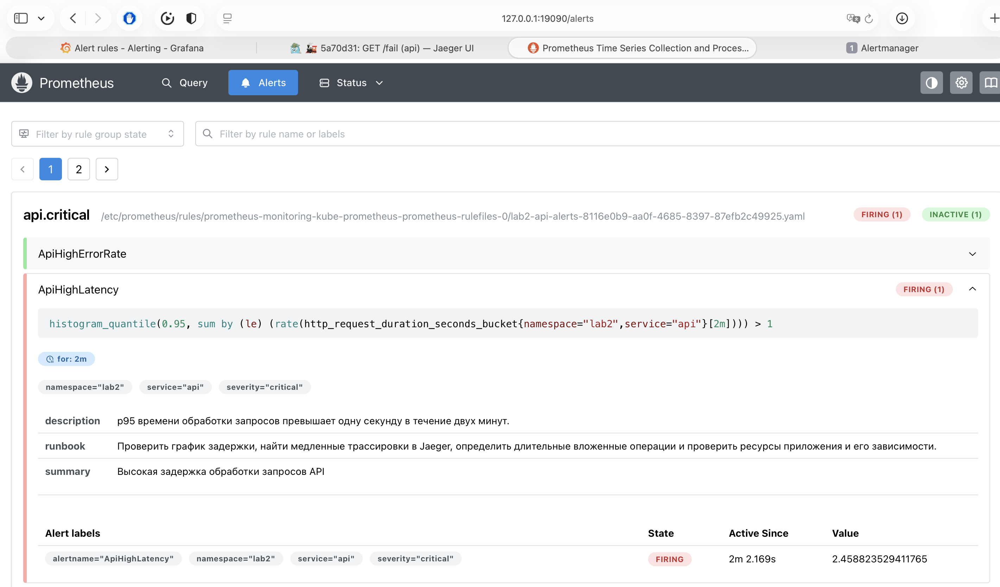

*Рисунок 59 - Срабатывание правила ApiHighLatency в Prometheus*

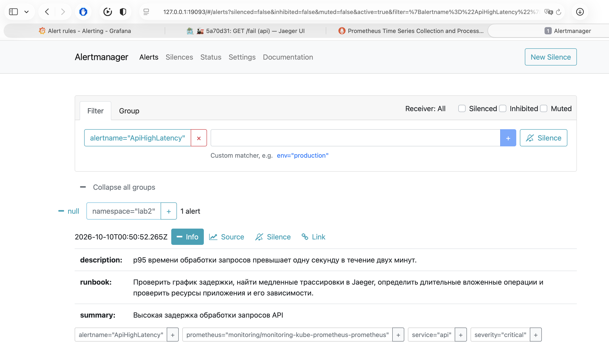

*Рисунок 60 - Оповещение ApiHighLatency в Alertmanager*

### 6.3. Недоступность - ApiUnavailable

Было добавлено критическое правило `ApiUnavailable`. Оно учитывает как неуспешный сбор метрик со всех экземпляров приложения, так и полное исчезновение целей сбора. Период ожидания составляет одну минуту. Это проверка доступности `/metrics` со стороны Prometheus: причина срабатывания может быть связана с приложением или соединением с ним. Для диагностики следует проверить Pod, Deployment, Service и EndpointSlice, события Kubernetes и доступность `/health` и `/metrics`.

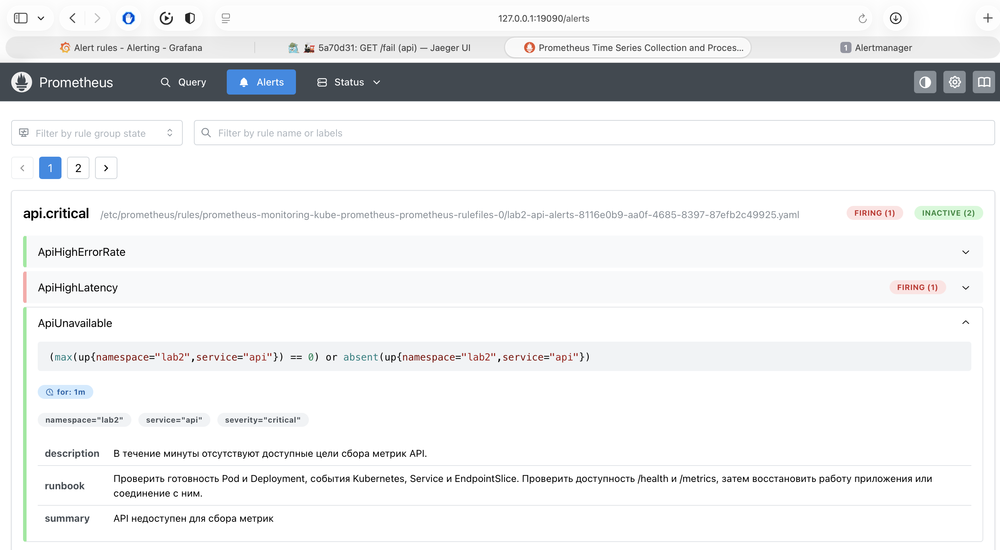

*Рисунок 61 - Правило ApiUnavailable для обнаружения недоступности целей сбора метрик API*

Для проверки правила `ApiUnavailable` число реплик приложения было временно уменьшено до нуля через Helm. После исчезновения целей сбора метрик и истечения периода ожидания правило перешло в состояние Firing. Оповещение было отображено в Alertmanager. Затем число реплик было восстановлено до единицы. После запуска Pod и возобновления сбора метрик правило вернулось в состояние Inactive.

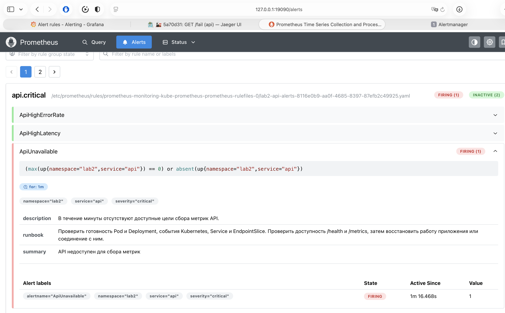

*Рисунок 62 - Срабатывание ApiUnavailable в Prometheus при остановке приложения*

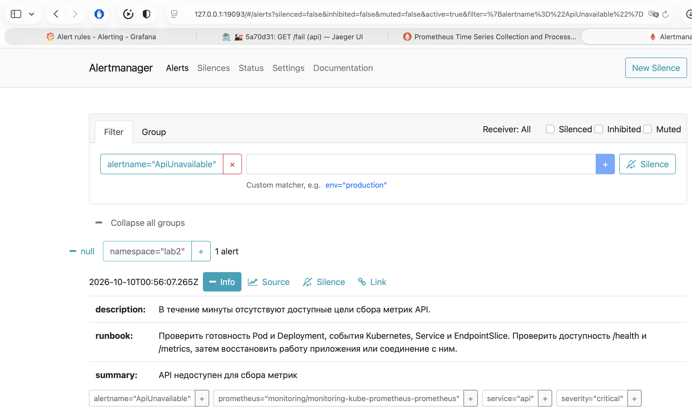

*Рисунок 63 - Оповещение ApiUnavailable в Alertmanager*

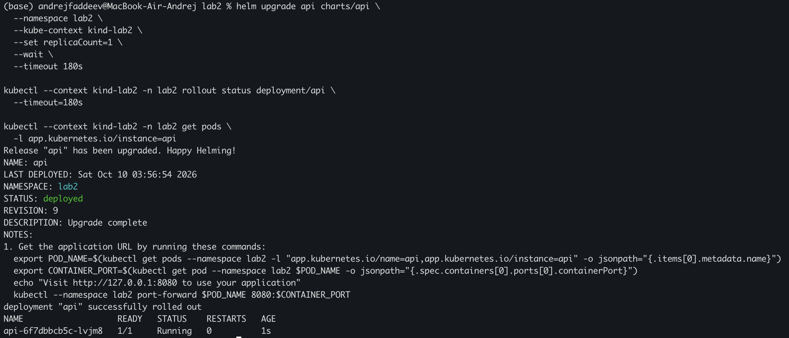

*Рисунок 64 - Восстановление Pod приложения api после проверки недоступности*

## 7. Отображение оповещений в Karma

### 7.1. Развёртывание и подключение

Для развёртывания интерфейса Karma был подключён Helm-репозиторий Wiremind и обновлён его индекс. Поиском была проверена доступность чарта Karma для последующей установки в кластер Kubernetes.

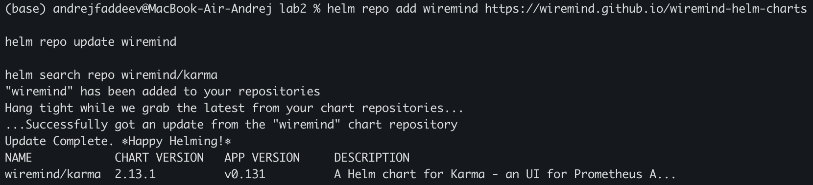

*Рисунок 65 - Подключение Helm-репозитория и поиск чарта Karma*

В пространстве имён monitoring с помощью Helm-чарта wiremind/karma версии 2.13.1 было развёрнуто приложение Karma версии v0.131. В настройках был указан внутренний адрес Service Alertmanager. После установки была проверена готовность Deployment и Pod, а также наличие Service для доступа к интерфейсу Karma.

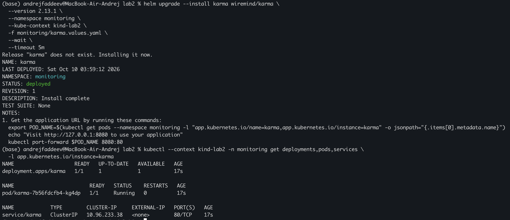

*Рисунок 66 - Развёртывание Karma и проверка готовности объектов Kubernetes*

Для доступа к Karma было настроено перенаправление локального порта 18090 на порт 80 соответствующего Service. В браузере был открыт интерфейс Karma и проверено получение данных от Alertmanager.

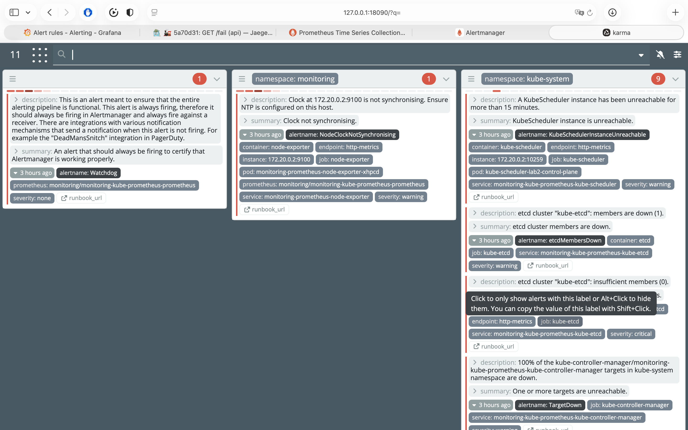

*Рисунок 67 - Веб-интерфейс Karma, подключённый к Alertmanager*

### 7.2. Проверка трёх оповещений

В Karma был применён фильтр по пространству имён lab2. Повторной последовательностью запросов к маршруту `/fail` было вызвано срабатывание правила `ApiHighErrorRate`. Полученное Alertmanager оповещение появилось в Karma с метками сервиса api и уровня critical.

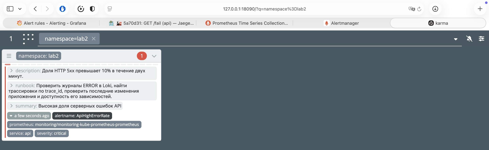

*Рисунок 68 - Отображение критического оповещения ApiHighErrorRate в Karma*

Последовательными запросами к маршруту `/slow` было повторно вызвано превышение порога p95 времени обработки запросов. После срабатывания правила `ApiHighLatency` соответствующее критическое оповещение появилось в Karma.

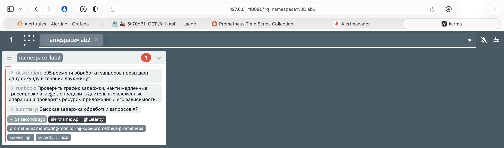

*Рисунок 69 - Отображение критического оповещения ApiHighLatency в Karma*

Для проверки отображения недоступности приложения в Karma число реплик API было временно уменьшено до нуля. После срабатывания правила `ApiUnavailable` в интерфейсе появилась карточка критического оповещения. Затем число реплик было восстановлено до единицы. После возобновления работы приложения и сбора метрик оповещение перестало отображаться среди активных.

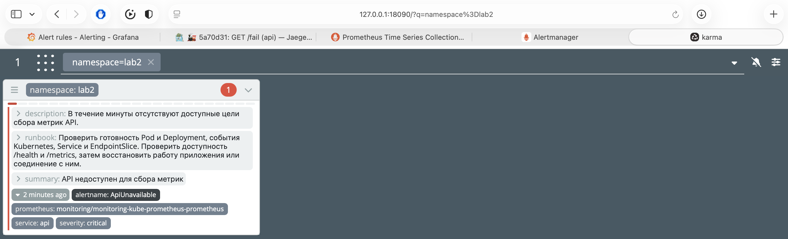

*Рисунок 70 - Отображение критического оповещения ApiUnavailable в Karma*

## 8. Доставка уведомлений через webhook

### 8.1. Приёмник и маршрут доставки

В пространстве имён monitoring через отдельный Helm-чарт был развёрнут локальный webhook-приёмник. Для него были созданы ConfigMap с кодом, Deployment и Service. Приёмник предоставляет маршрут `/alerts` для получения уведомлений и маршрут `/health` для проверки готовности. Pod перешёл в Running; в журнале появилась запись `webhook_started`.

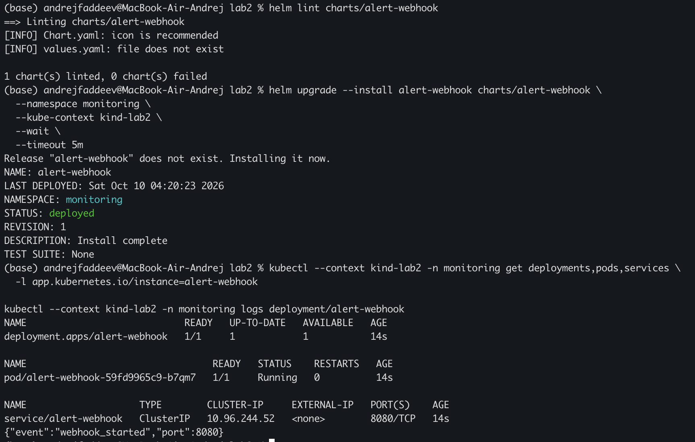

*Рисунок 71 - Развёртывание локального webhook-приёмника уведомлений*

В конфигурацию Alertmanager был добавлен получатель `local-webhook`. Для критических оповещений сервиса api в пространстве имён lab2 был настроен отдельный маршрут доставки на HTTP-адрес приёмника. Была включена отправка уведомлений об устранении проблемы. Настройки были применены через Helm и проверены в загруженной конфигурации Alertmanager.

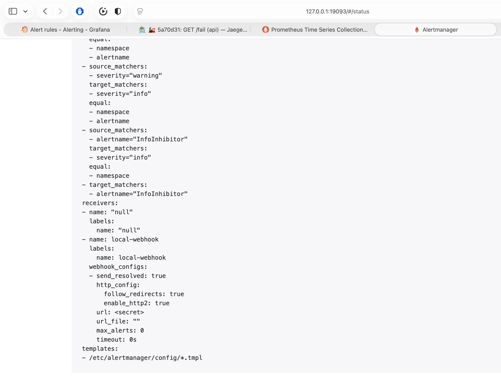

*Рисунок 72 - Webhook-получатель в загруженной конфигурации Alertmanager*

### 8.2. Уведомления firing и resolved

Повторными запросами к `/fail` было вызвано срабатывание `ApiHighErrorRate`. В журнале webhook-приёмника появилось уведомление с получателем `local-webhook`, статусом firing, уровнем critical и названием правила. После прекращения ошибочных запросов и завершения оповещения приёмник получил отдельное уведомление со статусом resolved.

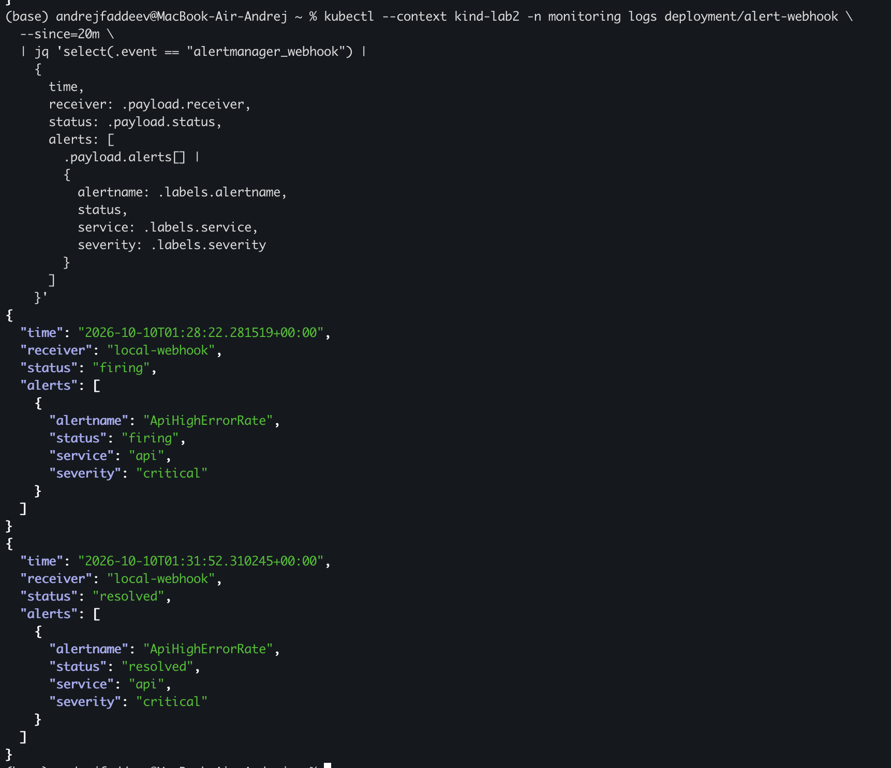

*Рисунок 73 - Получение webhook-уведомлений о срабатывании и завершении ApiHighErrorRate*

## 9. Итоговая проверка стенда

После завершения экспериментов была выполнена итоговая проверка стенда. Helm-релизы находились в состоянии deployed, контейнеры приложения и компонентов мониторинга были готовы к работе, постоянные тома - подключены. Значение метрики up для API составляло 1. Оповещения о высокой доле ошибок, задержке и недоступности приложения отсутствовали среди ожидающих и активных.

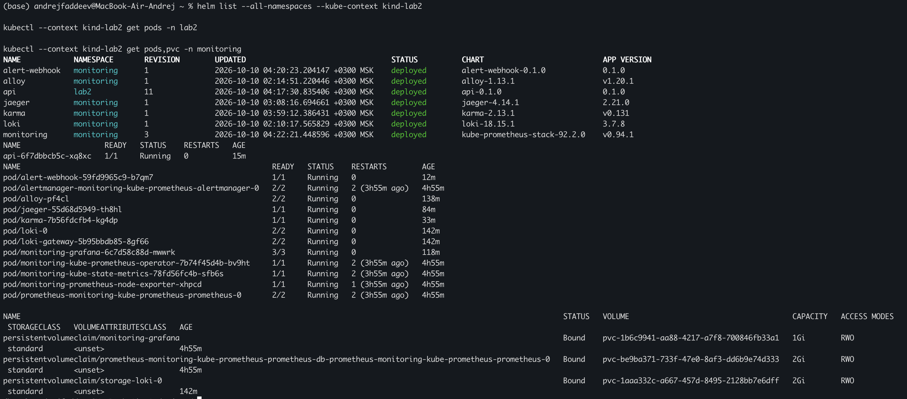

*Рисунок 74 - Итоговое состояние Helm-релизов стенда*

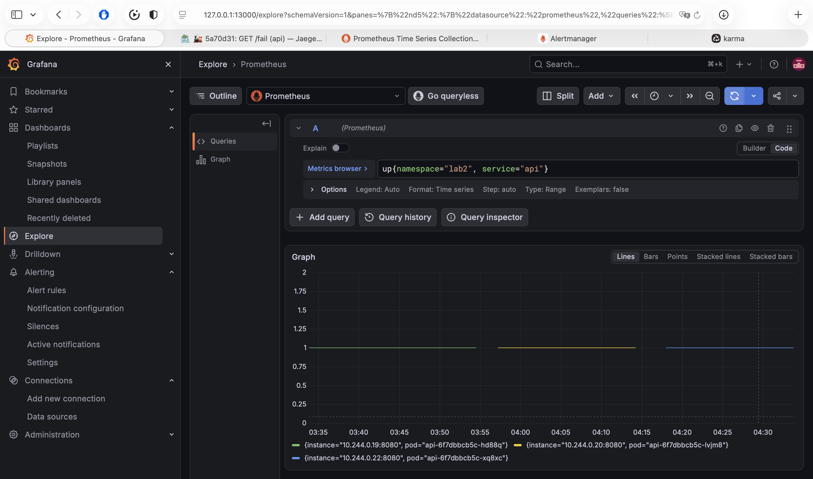

*Рисунок 75 - Готовность компонентов и состояние постоянных томов*

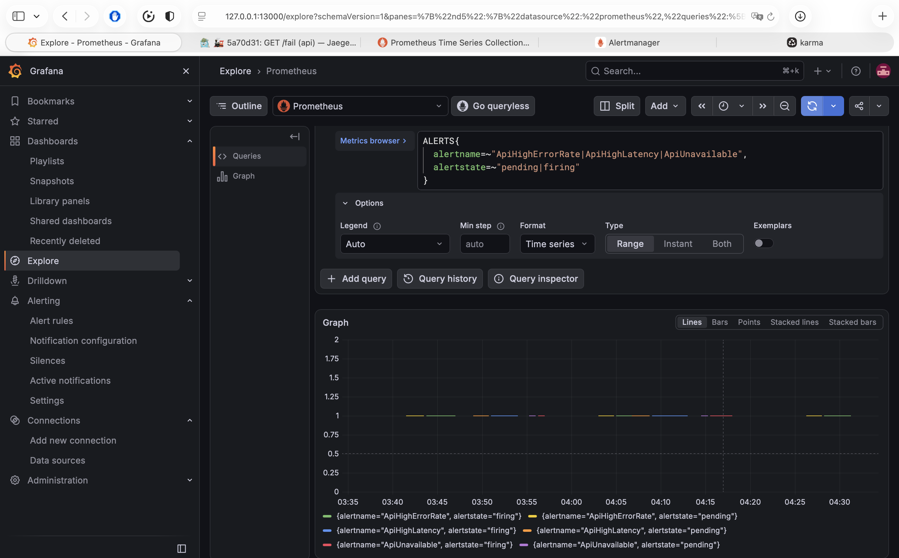

*Рисунок 76 - Статус оповещений*

## 10. Заключение

В результате выполнения лабораторной работы в локальном кластере Kubernetes был развёрнут стек наблюдаемости HTTP-сервиса api. Приложение и компоненты стека устанавливались и настраивались с помощью Helm.

Сбор метрик был организован средствами Prometheus. В Grafana был создан RED-дашборд, отображавший частоту запросов, долю серверных ошибок и p95 времени обработки. Запросами к маршрутам `/load`, `/fail` и `/slow` была проверена реакция графиков на изменение нагрузки, возникновение ошибок и увеличение задержки.

Для централизованного сбора журналов использовались Grafana Alloy и Loki. Трассировки OpenTelemetry передавались в Jaeger. Для запроса `/slow` была обнаружена длительная вложенная операция `slow-op`, а для `/fail` - признак ошибки и событие exception. По совпадающему `trace_id` была установлена связь между записью журнала в Loki и трассировкой в Jaeger.

Были настроены и проверены три критических оповещения: высокая доля серверных ошибок, превышение допустимого p95 времени обработки и отсутствие доступных целей сбора метрик API. Их срабатывание было проверено в Prometheus, Alertmanager и Karma. Локальный webhook-приёмник получил уведомления о срабатывании и завершении `ApiHighErrorRate`.

После экспериментов приложение было восстановлено, а работоспособность компонентов стенда проверена повторно. Проверки охватили рост нагрузки, ошибки HTTP 500, задержку ответов и остановку приложения.
