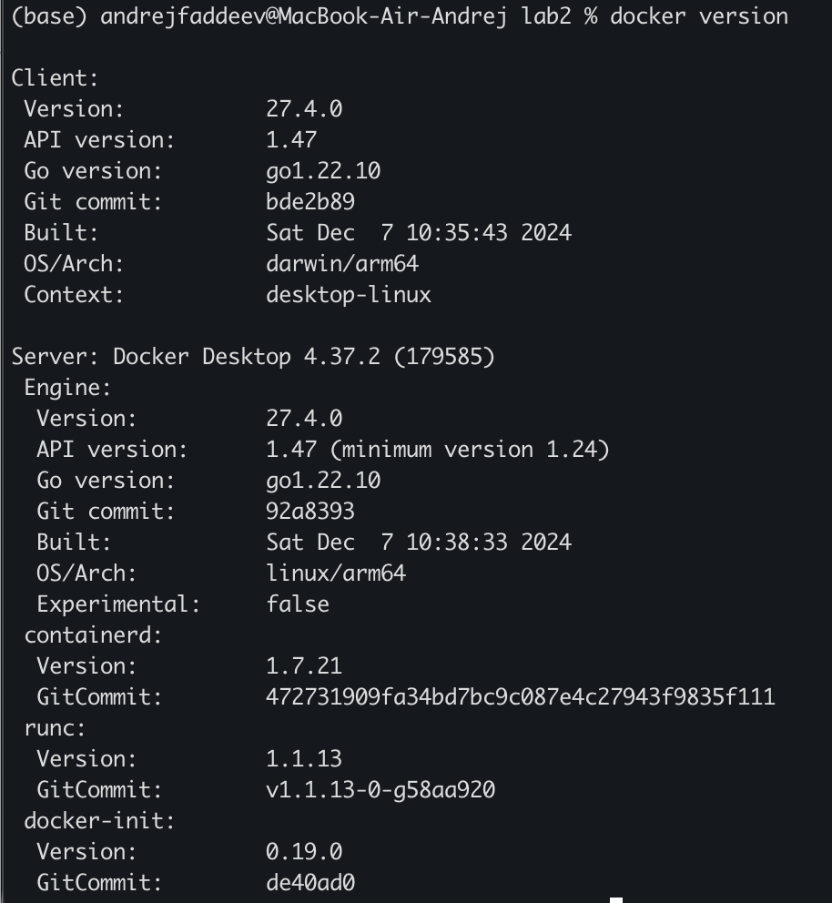
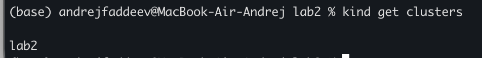
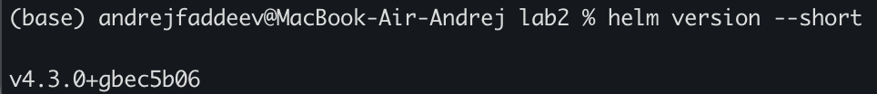
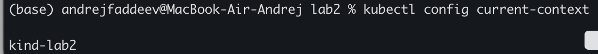
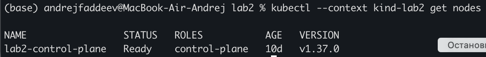

init

Перед развёртыванием системы мониторинга была проверена готовность рабочей среды. Были проверены доступность Docker Engine, наличие Helm и подключение к локальному кластеру Kubernetes, созданному с помощью kind. Было проверено состояние узла локального кластера Kubernetes kind-lab2. Узел lab2-control-plane находился в состоянии Ready и выполнял роль control-plane. Версия Kubernetes на узле составляла v1.37.0.

Рисунок 1 — Проверка версий клиента и сервера Docker

Рисунок 2 — Список локальных кластеров kind

Рисунок 3 — Проверка версии Helm

Рисунок 4 — Проверка текущего контекста kubectl

Рисунок 5 — Проверка готовности узла кластера kind-lab2

